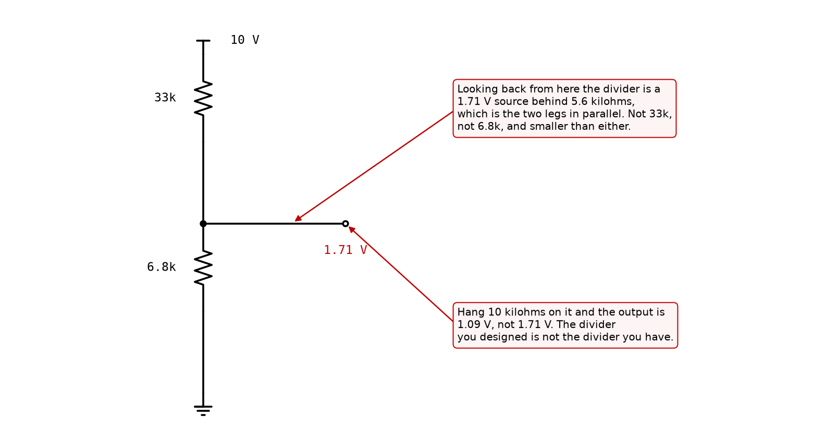
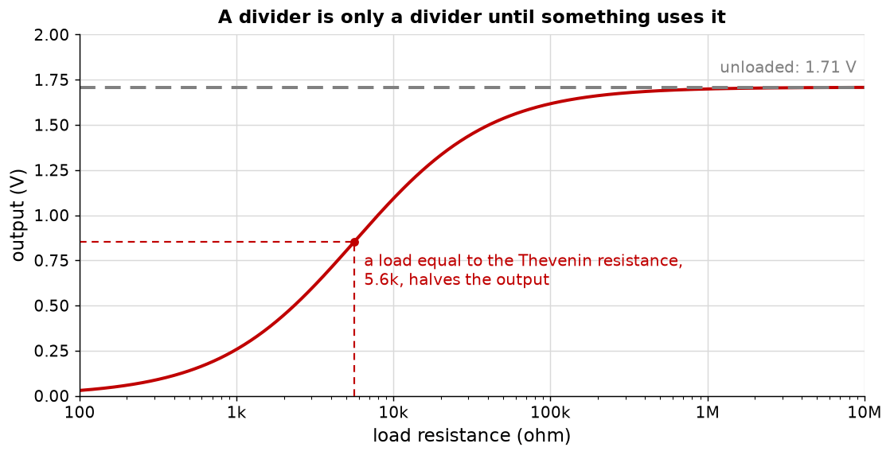

# Appendix A - Circuits, units, and loading

The circuit theory the rest of the course needs, and no more than that. If you have an electronics
background, read [A.1](#a1-the-sign-convention-and-why-it-is-worth-five-minutes) for the
convention this course fixes, then skip to
[A.6](#a6-loading-and-why-it-decides-everything-later), which is the section the other nine
lectures keep coming back to.

---

## A.1 The sign convention, and why it is worth five minutes

A current has a direction and a voltage has a polarity, and neither is discoverable from a
schematic. Both are choices, and this course makes them once:

* **Current into a terminal is positive.** A resistor with 1 V across it and 1 kilohm of
  resistance carries 1 mA into its positive terminal and 1 mA out of its negative one.
* **A voltage is always a difference,** and $V_{AB}$ means the potential at A minus the potential
  at B. A single-subscript voltage such as $V_C$ means the potential at C measured against ground.
* **Ground is node zero,** and its potential is zero by definition rather than by measurement.

None of that is deep and all of it is load-bearing. A bias calculation in L06 that comes out
negative is almost always a convention error rather than a physics error, and the same is true of
a gain that comes out positive when the stage inverts.

---

## A.2 The three quantities, and the one that is usually the answer

| Quantity   | Symbol | Unit   | What it is                                         |
| ---------- | ------ | ------ | -------------------------------------------------- |
| Current    | $I$    | ampere | Charge per second past a point.                    |
| Voltage    | $V$    | volt   | Energy per unit charge between two points.         |
| Resistance | $R$    | ohm    | The ratio of the two, when that ratio is constant. |
| Power      | $P$    | watt   | $VI$, and therefore $I^2R$ or $V^2/R$.             |

Ohm's law, $V = IR$, is not a law of nature. It is the definition of a resistor, and it is the
statement that some materials have a straight line where most have a curve. Every device in Part 2
of this course has a curve, and most of the work is in choosing where on the curve to sit so that
a straight line is a good enough description of the neighbourhood.

Power is the quantity that decides whether a design survives contact with a bench. A 1 kilohm
resistor with 10 V across it dissipates 100 mW, which a common surface-mount part will not
tolerate, and nothing in the schematic says so.

---

## A.3 Series, parallel, and the divider

Resistors in series add, because the same current passes through both and the voltages add:

$$R_{series} = R_1 + R_2$$

Resistors in parallel add as conductances, because the same voltage is across both and the
currents add:

$$\frac{1}{R_{parallel}} = \frac{1}{R_1} + \frac{1}{R_2}, \qquad R_{parallel} = \frac{R_1 R_2}{R_1 + R_2}$$

The parallel combination is always smaller than either part, which is worth stating because it is
the sanity check that catches most arithmetic slips. Two equal resistors in parallel give half.

The **voltage divider** is two resistors in series with the output taken between them:

$$V_{out} = V_{in} \frac{R_{lower}}{R_{upper} + R_{lower}}$$

This is the one circuit worth memorising, and it is worth memorising because it appears inside
almost everything else: the bias network of L06, the feedback network of L04, and the attenuator
in front of every oscilloscope.

For the divider in the figure, 33 kilohm over 6.8 kilohm on a 10 V supply:

$$V_{out} = 10 \times \frac{6800}{33000 + 6800} = 1.71\ \text{V}$$

<!-- value: 1.71 = divider(10.0, 33e3, 6.8e3) -->

That value is worth pausing on, because 1.65 V is what it looks like it ought to be and is not
what it is. There is no pair of E12 values that gives 1.65 V from a 10 V supply here; 33k over
6.8k gives 1.71 V, and L06 designs a transistor stage around the difference.

---

## A.4 Kirchhoff's two laws

Everything above is a special case of two statements, and they are the only physical content in
the whole of circuit theory.

**The current law.** The currents into any node sum to zero. Charge does not accumulate at a
junction, so whatever arrives leaves.

$$\sum_k I_k = 0$$

**The voltage law.** The voltages around any closed loop sum to zero. Potential is a property of a
point, so walking back to where you started must return you to the same potential.

$$\sum_k V_k = 0$$

Series and parallel are consequences of these; so is the divider. What matters for this course is
that the current law is the more useful of the two for a program, because it is naturally one
equation per node, and a node is something a netlist already has.

---

## A.5 Thevenin and Norton

Any network of linear elements, seen from two terminals, behaves exactly like a voltage source in
series with a resistance. That is Thevenin's theorem, and it is the reason a complicated circuit
can be replaced by two numbers when you only care what it does to the next stage.

* $V_{th}$ is the open-circuit voltage: what appears at the terminals with nothing attached.
* $R_{th}$ is the resistance seen looking back in, with every independent source killed. Killing a
  voltage source means replacing it with a short; killing a current source means an open circuit.

For the divider, killing the supply puts the upper leg's top on ground, so the two legs appear in
parallel:

$$R_{th} = R_{upper} \parallel R_{lower} = 5.64\ \text{k}\Omega$$

<!-- value: 5.64 = divider_output_resistance(33e3, 6.8e3) / 1e3 -->

Two things about that surprise people the first time. It does not depend on which leg you call the
upper one, and it is smaller than either leg. A divider made of two megohms has a Thevenin
resistance of one megohm, and a divider made of two ten-ohm resistors has five ohms; they have the
same ratio and nothing else in common.

**Norton** is the same statement with a current source in parallel with the same resistance, and
$I_{no} = V_{th}/R_{th}$. It is the more convenient of the two for nodal analysis, which is why
[Appendix B](./b_nodal_analysis.md) uses it without ever naming it.

---

## A.6 Loading, and why it decides everything later

A divider's formula assumes nothing is connected to its output. Connect something, and the lower
leg becomes the lower leg in parallel with whatever you connected.

For the 33k/6.8k divider, a 10 kilohm load gives

$$V_{out} = 10 \times \frac{6800 \parallel 10000}{33000 + (6800 \parallel 10000)} = 1.09\ \text{V}$$

<!-- value: 1.09 = divider(10.0, 33e3, 6.8e3, 10e3) -->

That is a third of the output gone, to a load most people would call light. The number that
predicts it is the Thevenin resistance: 10 kilohm is not large compared with 5.6 kilohm, so it is
not a light load.

The general rule, and the one to carry into every later lecture:

$$V_{delivered} = V_{th} \frac{R_{load}}{R_{th} + R_{load}}$$

A load equal to the Thevenin resistance halves the output. A load ten times larger costs about
9 per cent. A load ten times smaller leaves you with about 9 per cent.

**This is the idea the course is built on, and it will not stop appearing.** In
L03 two filter sections in a row do not give the corner you designed,
because the second loads the first. In L08 an emitter follower exists for no reason other than to
break a loading chain. In L10 an operational amplifier loses 11 dB of open-loop gain to it, which
is more than any other single term in the budget. Three lectures, three circuits, one piece of
arithmetic from this section.

---

## A.7 What this appendix is blind to

* **Everything is linear here.** A resistor has one resistance at every current. From
  L04 onwards that stops being true and the solver needs Newton-Raphson.
* **Everything is at DC.** No capacitor, no inductor, no frequency. L02 adds them, and adds them
  by making the same solver complex rather than by starting again.
* **Nothing has a tolerance.** Real resistors are 1 per cent or 5 per cent parts, and a divider
  built from two 5 per cent resistors has a ratio good to about 10 per cent. The course ignores
  that until it matters, which is L09, where the matching of two transistors decides the whole
  performance of a stage.

---
