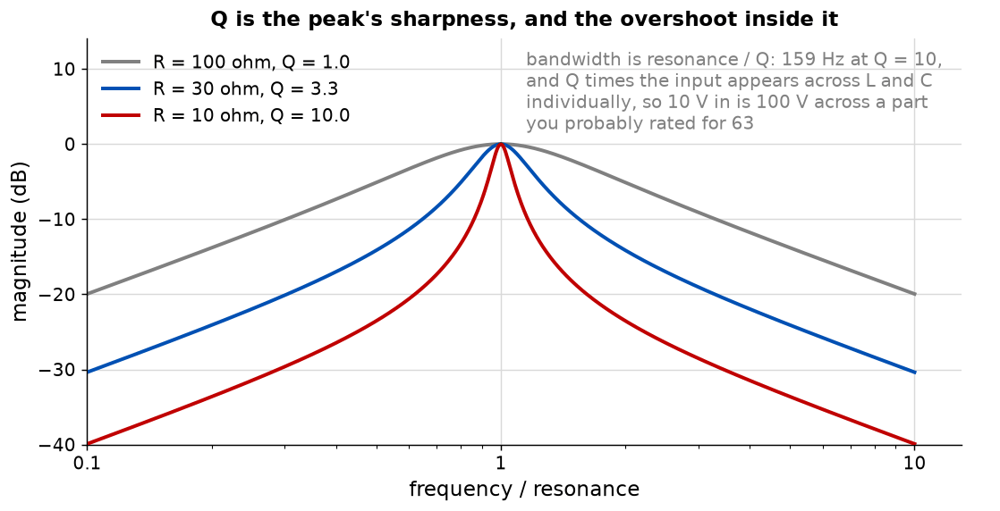

# Appendix A - Passive filters, cascading, and Q

The first useful circuits in the course, and the third appearance of the one piece of arithmetic
that decides everything.

---

## A.1 Two components, four filters

A resistor and a capacitor in series make a divider whose ratio depends on frequency. Which of the
two you take the output across decides what kind of filter it is.

$$H_{LP} = \frac{1}{1 + j f/f_c}, \qquad H_{HP} = \frac{j f/f_c}{1 + j f/f_c}$$

Both have the same corner, $f_c = 1/(2\pi RC)$, and both are 3 dB down there. Swap the resistor
and capacitor and a low-pass becomes a high-pass; swap the capacitor for an inductor and the same
happens again.

At the corner the two are not merely mirror images. The low-pass lags by 45 degrees and the
high-pass leads by 45 degrees, and their outputs are therefore 90 degrees apart. Add them and you
get exactly the input back, at every frequency, which is worth checking once because it is not
obvious and it is the cleanest statement of what "complementary" means.

A **band-pass** is a high-pass and a low-pass in series, with the high-pass corner below the
low-pass corner. It reaches 0 dB in the middle only if the two corners are well apart; with them a
decade apart it falls about 0.9 dB short, and with them equal it never gets closer than 6 dB.

---

## A.2 A filter's own impedances

A filter is a two-port, and both of its ports have an impedance that depends on frequency. Both
matter, for the same reason they mattered in L01: the source upstream and the load downstream form
dividers with them.

For a low-pass RC, looking in from the input:

$$Z_{in} = R + \frac{1}{j\omega C}$$

At low frequency that is dominated by the capacitor and is large; at high frequency it approaches
$R$. Looking back from the output, with the source shorted:

$$Z_{out} = R \parallel \frac{1}{j\omega C}$$

which is $R$ at low frequency and approaches zero at high frequency.

**That last result is the whole of the next section.** A low-pass RC presents its own series
resistance as an output impedance at low frequency, and the next stage sees it.

---

## A.3 Cascading, and the corner you did not design

Put two identical low-pass sections in a row and it is tempting to reason that each contributes
its own pole, so the response is the square of one section's response, 6 dB down at the corner and
falling at 40 dB per decade.

**That is the answer for two sections with a buffer between them, and it is wrong for two sections
connected directly.**

The second section loads the first. Its input impedance is in parallel with the first section's
capacitor, which moves the first section's pole, and the two poles split apart:

$$f_{low} = f_c \frac{3 - \sqrt{5}}{2} = 0.382 f_c, \qquad f_{high} = f_c \frac{3 + \sqrt{5}}{2} = 2.618 f_c$$

Their product is $f_c^2$, so what the loading does is push one pole down and the other up by the
same factor while leaving the geometric mean alone.

The half-power point of the pair lands at

| Arrangement                     | 3 dB point  |
| ------------------------------- | ----------- |
| One section                     | $1.000 f_c$ |
| Two sections, buffered          | $0.644 f_c$ |
| Two sections, cascaded directly | $0.374 f_c$ |

<!-- value: 0.374 = cascaded_corner(1e3, 159e-9) / rc_corner(1e3, 159e-9) -->

The direct cascade is a factor of **1.72** lower than the buffered pair. A filter designed by
multiplying two responses together and built by soldering two sections together is not the filter
that was designed.

**The fix is a buffer**, meaning something with a high input impedance and a low output impedance
placed between the sections so that the second cannot load the first. That is exactly what an
operational amplifier configured as a follower is for, and it is why this lecture covers filters
and op-amps together rather than in two separate lectures.

**This is L01's arithmetic for the third time.** A divider loaded by 10 kilohm loses a third of its
output; L02's filter corner moved by 6.6 times because the capacitor saw the source resistance;
here two filter sections move each other's poles. In L10 an operational amplifier loses 11 dB the
same way.

---

## A.4 LC, resonance, and Q

An inductor and a capacitor have reactances of opposite sign, so at one frequency they cancel:

$$f_0 = \frac{1}{2\pi\sqrt{LC}}$$

In series they cancel to zero impedance and in parallel to infinite impedance. Nothing about that
frequency depends on any resistance, which is what makes a resonance different in kind from an RC
corner.

The resistance decides how sharp it is. For a series RLC with the output taken across the
resistor:

$$Q = \frac{1}{R}\sqrt{\frac{L}{C}}, \qquad \text{bandwidth} = \frac{f_0}{Q}$$

**Q is two things at once, and the second is the one that gets people.** It is the sharpness of the
peak, and it is also the factor by which the voltage across the inductor and across the capacitor
individually exceeds the input.

At resonance the series LC is a short, so the full input appears across the resistor and the
current is $V/R$. That current flows through the inductor's reactance, which is $Q$ times $R$, so

$$V_L = Q \times V_{in}$$

A Q of 10 with 10 V applied puts 100 V across a capacitor. This is how a filter that is correct on
paper destroys a component on a bench, and it is not visible anywhere in the transfer function,
because the transfer function only describes the output.

---

## A.5 Higher orders, and what this course does not do

Two poles is as far as this course goes, and it gets there by cascading rather than by designing.

A real filter design starts from a specification, chooses a polynomial that meets it with the
fewest poles, and then realises that polynomial as a circuit. Butterworth for a flat passband,
Chebyshev for a steeper transition at the cost of passband ripple, Bessel for a flat group delay.
Sallen-Key and multiple-feedback are the usual realisations, and L04
builds one Sallen-Key because it is the cheapest way to get a complex pole pair out of one
amplifier.

What this course leaves out entirely: pole placement, the approximation problem, sensitivity to
component tolerance, and switched-capacitor realisations.

---

## A.6 What this appendix is blind to

* **Component tolerance.** Every corner here is computed from nominal values. A filter built from
  5 per cent parts has a corner good to about 7 per cent, and a high-Q filter is far worse than
  that because Q depends on a ratio of two square roots.
* **Real inductors.** The Q values above assume the resistance is the one you put there. A real
  inductor's winding resistance is often the dominant term, and it puts a ceiling on Q that no
  choice of external resistor can lift.
* **Transients.** A high-Q filter rings. How long for is a time-domain question and this course
  does not compute it, though the answer is roughly $Q$ cycles.

---
