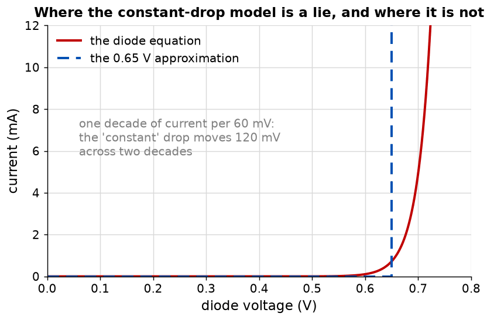
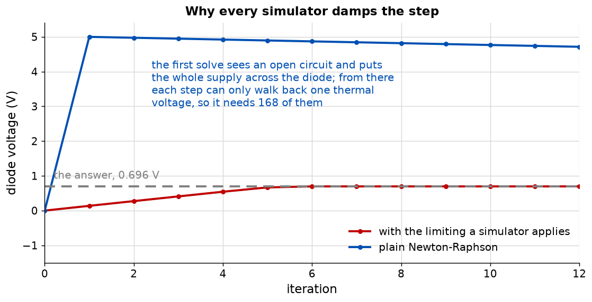

# Appendix B - The diode, and solving for it
The first device in this course that is not linear, and the machinery that makes a nonlinear
circuit solvable at all.

---

## B.1 The diode equation
$$I = I_S \left( e^{V/V_T} - 1 \right)$$

$I_S$ is the saturation current, around $10^{-14}$ A for a small-signal diode; $V_T$ is the thermal
voltage, 26 mV. That is the whole model. Two consequences do all the work.

**A decade of current costs 60 mV,** from $V_T \ln 10 = 59.9$ mV. A diode at 1 mA and 0.65 V is at
0.71 V for 10 mA and 0.59 V for 100 microamps.

**The slope is proportional to the current.**

$$g = \frac{dI}{dV} = \frac{I + I_S}{V_T} \approx \frac{I}{V_T}$$

So the incremental resistance is $V_T/I$, 26 ohm at 1 mA. **That is the same quantity as $r_e$, the
intrinsic emitter resistance the whole of Part 2 is built on,** and for the same reason: a
base-emitter junction is a diode.

---

## B.2 The 0.7 volt model, and where it fails
The constant-drop model replaces the exponential with a switch that turns on at 0.65 V. Crude,
universal, usually good enough, which makes its failure mode worth more than dismissing it.



It is exact at exactly one current, the one where the real diode sits at 0.65 V. Either side of
that it is wrong, and the direction reverses:

| Series resistor | Real diode voltage | Real current    | Constant-drop current | Error         |
| --------------- | ------------------ | --------------- | --------------------- | ------------- |
| 1 kilohm        | 0.697 V            | 4.30 mA         | 4.35 mA               | +1.1 per cent |
| 100 kilohm      | 0.578 V            | 44.2 microamps  | 43.5 microamps        | -1.6 per cent |
| 10 megohm       | 0.458 V            | 0.454 microamps | 0.435 microamps       | -4.2 per cent |

All from a 5 V supply. **The error in the current stays small and the error in the diode voltage
does not:** the drop moves 240 mV, from 0.70 V to 0.46 V, across a model that calls it constant.

**That distinction is what matters in Part 2.** A bias network assuming a fixed 0.65 V gets the
collector current about right, because the drop appears inside a subtraction where a few tens of
millivolts do not matter. Where the same millivolts appear inside an exponential, as in L06's
thermal drift, the constant-drop model says nothing at all.

---

## B.3 Newton-Raphson
A nonlinear circuit cannot be solved in one pass, because the diode's conductance depends on the
answer. Guess, linearise, solve, repeat.

At a guessed $V_k$, replace the diode with its tangent: a conductance $g_k$ in parallel with a
current source $I_{eq}$ that makes the tangent pass through the operating point.

$$g_k = \frac{I_k + I_S}{V_T}, \qquad I_{eq} = I_k - g_k V_k$$

Both stamp into the linear solver of L01, the conductance like a resistor and the equivalent
current like a current source. Solve, take the new node voltage as the next guess, iterate until
the change is small.

**Every nonlinear simulator is that loop.** The rest is bookkeeping and better device models.

---

## B.4 Why plain Newton-Raphson does not work
Start at zero volts. The diode carries no current, so its conductance is $I_S/V_T$, about
$10^{-12}$ siemens, an open circuit, and the first solve puts the entire supply across the diode.

At 5 V the exponential's slope is astronomical and the tangent is almost vertical. Each iteration
walks back down by about one thermal voltage, so 5 V to 0.7 V takes **168 iterations**, from a
method advertised as quadratic.



The fix every simulator applies is to damp a large increasing step by taking it in the logarithm:

$$V_{k+1} \leftarrow V_k + V_T \ln\left(1 + \frac{\Delta V}{V_T}\right) \quad \text{when } \Delta V > 2V_T$$

With that, the same circuit converges in **seven** iterations.

**This is not a trick to make the demonstration work.** It is what SPICE does, and a solver without
it will appear to work on every circuit in this appendix and then fail to converge on the first
transistor circuit in L06.

---

## B.5 What to build
### An addition to `ael/net/netlist.hpp`
```cpp
/// An ideal diode, anode to cathode, with the given saturation current.
void addDiode(Node anode, Node cathode, double saturationCurrent = 1.0e-14) noexcept;
[[nodiscard]] std::size_t diodeCount() const noexcept;
```

### `ael/feedback/loop.hpp`
| Function                         | Returns                                                  |
| -------------------------------- | -------------------------------------------------------- |
| `loopGain(openLoop, beta)`       | $T = A\beta$.                                            |
| `closedLoopGain(openLoop, beta)` | $A/(1 + T)$.                                             |
| `gainError(openLoop, beta)`      | $1/(1 + T)$, the fraction by which the gain falls short. |

Three lines each. They are worth writing rather than remembering because
[A.4](./a_feedback.md#a4-what-it-costs-gain-bandwidth) makes them functions of frequency: the
open-loop gain handed to them is the gain at the frequency of interest, not the datasheet's.

### `ael/device/diode.hpp`
| Function                           | Returns                                                               |
| ---------------------------------- | --------------------------------------------------------------------- |
| `current(voltage, saturation)`     | The diode equation.                                                   |
| `conductance(voltage, saturation)` | Its derivative, $(I + I_S)/V_T$.                                      |
| `limit(proposed, previous)`        | The damped step of [B.4](#b4-why-plain-newton-raphson-does-not-work). |

### `ael/nr/solve.hpp`
```cpp
namespace ael::nr
{
struct Solution
{
    std::vector<double> nodeVoltages{};
    std::vector<double> sourceCurrents{};
    std::size_t iterations{};   ///< How many it took. Zero means it did not run.
    bool converged{false};
};

/// Iterate to a DC operating point. Converged when every node moves less than `tolerance`.
[[nodiscard]] Solution solve(const net::Netlist& netlist, double tolerance = 1.0e-9,
                             std::size_t maxIterations = 100U) noexcept;
}
```

Three things the suite checks:
* **`iterations` is reported,** because it is the diagnostic that says whether the limiting works.
  Seven is healthy; ninety is converging linearly and will fail on something larger.
* **`converged` is false rather than silently returning the last iterate** when the loop runs out.
  This is L01's `solved` flag again, for the same reason.
* **A netlist with no diodes gives the same answer as `ael::mna::solve`,** in one iteration. A
  nonlinear solver that cannot reproduce the linear one on a linear circuit has a bug that will be
  much harder to find later.

### What good looks like
About fifty lines on top of L01: fifteen for the loop, five for the limiting. Much more, and the
linear solve is probably being rebuilt from scratch each iteration rather than restamped.

---

## B.6 What this appendix is blind to
* **Reverse breakdown.** The equation says a reverse-biased diode carries $-I_S$ forever. A real
  one avalanches somewhere between 5 V and a few hundred, and a Zener is sold for that behaviour.
* **Capacitance.** A real diode has junction and diffusion capacitance, so a rectifier conducts
  briefly in reverse when switched off.
* **Temperature.** $I_S$ roughly doubles every 5 degrees and $V_T$ is proportional to absolute
  temperature. Net, a forward drop falling about 2 mV per degree: the $-2$ mV/K that dominates L06.
* **Convergence in general.** The limiting here handles one exponential device. Several
  interacting nonlinearities can still fail, and real simulators carry more strategies for it.

---
