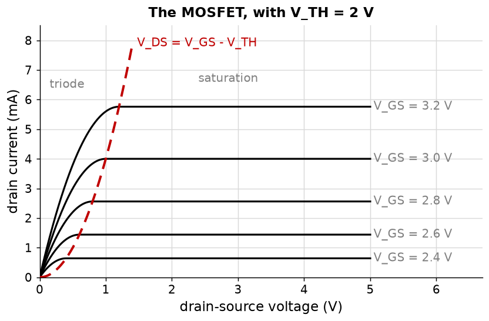
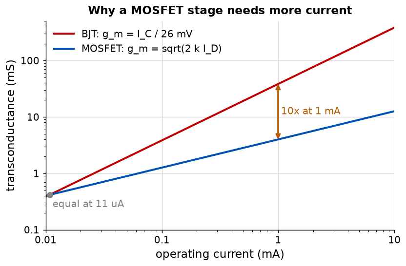

# Appendix B - The MOSFET, the comparison, and what to build
A different device with the same three regions, a square law instead of an exponential, and one
number that decides every comparison between the two.

---

## B.1 The MOSFET in two regions
A gate voltage creates a channel between drain and source. Below the **threshold** $V_{TH}$ there
is no channel. Above it, which region applies depends on whether the drain voltage is large enough
to pinch the channel off at the drain end.

$$I_D = \begin{cases}
0 & V_{GS} < V_{TH} \\
k\left[(V_{GS}-V_{TH})V_{DS} - \tfrac{1}{2}V_{DS}^2\right] & V_{DS} < V_{GS}-V_{TH} \quad \text{(triode)} \\
\tfrac{1}{2}k(V_{GS}-V_{TH})^2 & V_{DS} \ge V_{GS}-V_{TH} \quad \text{(saturation)}
\end{cases}$$

$V_{GS} - V_{TH}$ is the **overdrive**, and almost every MOSFET result is more natural in terms of
it than of $V_{GS}$.



**The naming is unfortunate and worth stating once.** A MOSFET's *saturation* is where it acts as
a current source, which is a BJT's *active*. A MOSFET's *triode* is where it acts as a resistor,
which is a BJT's *saturation*. Confusing them is a standard way to misread a datasheet.

**The gate draws no current:** it is an insulated capacitor plate. That is why a MOSFET's input
resistance is effectively infinite at DC, and why L07's input-resistance results do not carry
across between the two devices the way everything else does.

---

## B.2 Transconductance, and the factor of ten
$$g_m = k(V_{GS}-V_{TH}) = \sqrt{2 k I_D}$$

**A MOSFET's transconductance goes as the square root of its current. A BJT's goes as the current
itself,** $g_m = I_C/V_T$. That difference decides every comparison between them.



At 1 mA a BJT gives 38.5 mS and a representative MOSFET about 4 mS: **a factor of ten**.

<!-- value: 38.5 = transconductance(1e-3) * 1e3 -->

* **A MOSFET stage needs about ten times the current** of a BJT stage for the same gain, or a much
  larger device.
* **The advantage grows with current,** as $\sqrt{I}$. At 10 mA the BJT wins by thirty; at 10
  microamps the two are comparable.
* **L07's source factor is about two where the emitter factor is about ten,** for the same 220 mV
  across the degeneration resistor. This is the entire reason for it.

**One caveat the figure cannot show.** The square law says the two are equal near 11 microamps and
the MOSFET wins below. A real MOSFET leaves the square law well before then: in weak inversion it
conducts exponentially and $g_m$ approaches $I_D/(nV_T)$, the BJT's result divided by one or two.
The curves converging is real; the crossing is an artifact of the model.

---

## B.3 Choosing between them, honestly
|                          | BJT                                    | MOSFET                                        |
| ------------------------ | -------------------------------------- | --------------------------------------------- |
| Transconductance at 1 mA | 38.5 mS                                | About 4 mS                                    |
| Input current            | $I_C/\beta$, real and troublesome      | None at DC                                    |
| Turn-on voltage          | 0.6 to 0.7 V, and predictable          | 1 to 4 V, and poorly controlled               |
| As a switch              | Saturation voltage, roughly fixed      | On-resistance, so the drop falls with current |
| Matching between devices | Excellent, and exponential in $V_{BE}$ | Poorer, and it limits offset                  |

**BJTs for gain and for matched pairs; MOSFETs for switches and for inputs that must draw no
current.** A discrete amplifier built for gain is usually bipolar, a power switch usually a
MOSFET, and an instrument input that must not load its source a MOSFET whatever else it costs.

---

## B.4 What to build
### `ael/device/bjt.hpp`
The model is the **transport form**, which handles all three regions with one expression and no
branching:

$$I_C = I_S\left(e^{V_{BE}/V_T} - e^{V_{BC}/V_T}\right) - \frac{I_S}{\beta_R}\left(e^{V_{BC}/V_T}-1\right)$$

$$I_B = \frac{I_S}{\beta_F}\left(e^{V_{BE}/V_T}-1\right) + \frac{I_S}{\beta_R}\left(e^{V_{BC}/V_T}-1\right)$$

With the collector reverse biased the second exponential vanishes and this collapses to
$I_C = \beta_F I_B$. Drive the base hard enough that the collector falls below it and the second
exponential takes over, the collector current stops rising, and the device is saturated.
**Saturation is not a special case in the code; it is what the equation does.**

| Member                                         | Contract                                                                               |
| ---------------------------------------------- | -------------------------------------------------------------------------------------- |
| `struct Parameters`                            | `saturationCurrent` $10^{-14}$, `forwardBeta` 50, `reverseBeta` 2, `earlyVoltage` 100. |
| `struct Currents`                              | `base`, `collector`, `emitter`.                                                        |
| `currents(vbe, vbc, parameters)`               | The two expressions above, with `emitter` their sum.                                   |
| `region(vbe, vbc)`                             | `Cutoff`, `Active`, `Saturation` or `ReverseActive`.                                   |
| `baseResistor(drive, loadCurrent, forcedBeta)` | The switch design of [A.4](./a_the_bipolar_transistor.md#a4-designing-a-switch).       |

### `ael/device/mosfet.hpp`
| Member                                       | Contract                                                             |
| -------------------------------------------- | -------------------------------------------------------------------- |
| `struct Parameters`                          | `threshold` 2 V, `transconductanceParameter` $8\ \text{mA/V}^2$.     |
| `drainCurrent(vgs, vds, parameters)`         | The three-region expression of [B.1](#b1-the-mosfet-in-two-regions). |
| `transconductance(drainCurrent, parameters)` | $\sqrt{2kI_D}$.                                                      |
| `region(vgs, vds, parameters)`               | `Cutoff`, `Triode` or `Saturation`.                                  |

### An addition to `ael/net/netlist.hpp`
```cpp
void addBjt(Node collector, Node base, Node emitter, device::bjt::Parameters parameters = {}) noexcept;
[[nodiscard]] std::size_t bjtCount() const noexcept;
```

The nonlinear solver of [L04](../../L04/README.md) has to stamp it. A BJT stamps as **two diodes
and one controlled current source**, so it contributes nine matrix entries rather than four, and
L04 B.4's limiting must be applied to both junction voltages rather than one.

**That last point is not optional.** A transistor circuit started from zero has both junctions
forward biased at the first solve, and without limiting on both the iteration will not converge at
all. This is the circuit L04 warned would fail.

### What good looks like
About eighty lines for the two device models and forty for the stamp. If the stamp branches on
which region the device is in, it is fighting the transport model rather than using it.

---

## B.5 What this appendix is blind to
* **Channel-length modulation.** The saturation expression has no $V_{DS}$ dependence, so a
  MOSFET's output resistance is infinite here. L07 needs it finite and reintroduces it as $r_o$.
* **The body effect.** A MOSFET whose source is not at the substrate potential has a higher
  threshold, and in a follower that is a real loss. Named and not modelled.
* **Short-channel behaviour.** Modern devices left the square law behind decades ago; it is good
  enough for discrete parts at the currents used here.
* **Temperature.** Both models are at one temperature. L06 is entirely about what happens when
  that changes.

---
