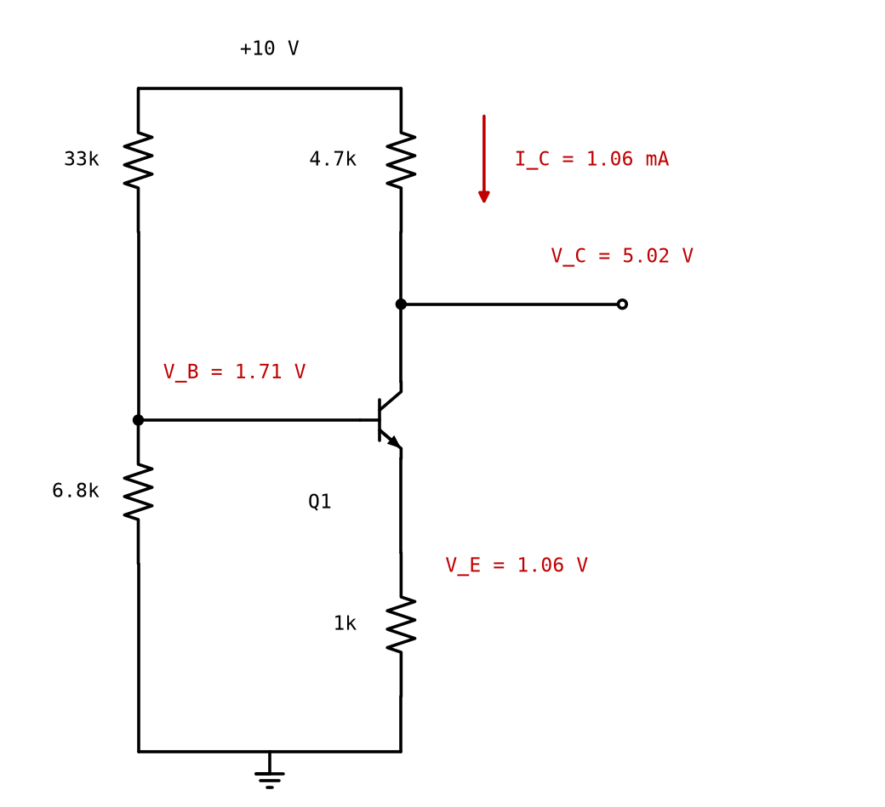

# Appendix A - The quiescent point, and the divider that loads itself
An amplifier is a transistor held at an operating point with a signal moving it about. This
appendix is the holding still.

---

## A.1 Three numbers and a line
The **quiescent point** is where a stage sits with no signal applied: collector current,
collector-emitter voltage, base-emitter voltage. The third is almost always about 0.65 V, so in
practice it is two.

The load line of [L05 A.3](../../L05/appendix/a_the_bipolar_transistor.md#a3-three-regions)
constrains them:

$$V_{CE} = V_{CC} - I_C(R_C + R_E)$$

**Where on that line to sit is the first design decision.** A switch used the two ends; an
amplifier wants room to move both ways, so it sits where the headroom above and below matches the
wanted swing. Too near the supply clips the positive half of the output, too near saturation the
negative half, and both waste the stage.

---

## A.2 Divider bias

A divider sets the base voltage, the emitter follows one diode drop below, and the emitter
resistor turns that voltage into a current:

$$V_B = V_{CC}\frac{R_2}{R_1 + R_2}, \qquad V_E = V_B - V_{BE}, \qquad I_C \approx \frac{V_E}{R_E}$$

For the values in the figure, 33 kilohm over 6.8 kilohm on 10 V:

$$V_B = 1.71\ \text{V}, \qquad V_E = 1.06\ \text{V}, \qquad I_C = 1.06\ \text{mA}$$

<!-- value: 1.71 = divider(10.0, 33e3, 6.8e3) -->

**Those expressions assume nothing is drawing current from the divider. Something is.**

---

## A.3 The base current loads the divider
$$I_B \approx \frac{I_C}{\beta} = \frac{1\ \text{mA}}{50} = 20\ \mu\text{A}$$

as a first estimate, and it flows out of the divider through its Thevenin resistance of
[5.64 kilohm](../../L01/appendix/a_circuits_and_units.md#a5-thevenin-and-norton), so the base
voltage droops. Solved to convergence the base current settles at 18.7 microamps:

$$\Delta V_B = I_B R_{th} = 18.7\ \mu\text{A} \times 5.64\ \text{k}\Omega = 105\ \text{mV}$$

The base sits at **1.60 V**, not 1.71, and the collector current is **0.934 mA**, not 1.06. The
emitter resistor carries the *emitter* current, 0.953 mA; the collector gets $\beta/(\beta+1)$ of
it, and at $\beta = 50$ that two per cent is worth keeping in a calculation whose whole subject is
the base current.

<!-- value: 0.934 = 1e3 * loaded_bias_current(10.0, 33e3, 6.8e3, 1e3) -->
<!-- value: 105 = 1e3 * loaded_bias_droop(10.0, 33e3, 6.8e3, 1e3) -->

**A 12 per cent error, and L01's loading arithmetic for the fourth time.** A divider loses a third
of its output to a 10 kilohm load, a filter corner moves, two filter sections move each other's
poles, and here a bias point moves 12 per cent. [L08](../../L08/README.md) and
[L10](../../L10/README.md) are the fifth and the sixth.

<!-- value: 12 = 100.0 * loaded_bias_error(10.0, 33e3, 6.8e3, 1e3) -->

**It is also self-referential,** which is why it needs solving rather than substituting: the base
current depends on the collector current, which depends on the base voltage, which depends on the
base current. Two iterations by hand converge; a solver does not notice the difficulty.

---

## A.4 Stiffness
Make the divider carry much more current than the base takes, so that the base current is a small
perturbation on it. That ratio is the divider's **stiffness**:

$$\text{stiffness} = \frac{I_{divider}}{I_B}$$

Here the divider carries 251 microamps and the base takes 18.7, so the stiffness is **13.4**. The
usual rule of thumb is ten.

**And the rule of thumb is why the error was 12 per cent.** A stiffness of ten accepts roughly one
part in ten of the droop, which lands as ten-ish per cent in the collector current. The cure is a
stiffer divider and the cost is supply current, one decade for one decade.

| Stiffness         | Divider current here | Error in $I_C$ |
| ----------------- | -------------------- | -------------- |
| 13.4, as designed | 251 microamps        | 12 per cent    |
| 50                | 1.0 mA               | 4.6 per cent   |
| 200               | 4.1 mA               | 2.6 per cent   |

<!-- value: 1.0 = 1e3 * divider_current_for_stiffness(10.0, 33e3, 6.8e3, 1e3, 50.0) -->
<!-- value: 4.1 = 1e3 * divider_current_for_stiffness(10.0, 33e3, 6.8e3, 1e3, 200.0) -->
<!-- value: 4.6 = 100.0 * bias_error_for_stiffness(10.0, 33e3, 6.8e3, 1e3, 50.0) -->
<!-- value: 2.6 = 100.0 * bias_error_for_stiffness(10.0, 33e3, 6.8e3, 1e3, 200.0) -->

**Those currents are not the first row scaled up,** and the reason is
[A.3](#a3-the-base-current-loads-the-divider) a second time: a stiffer divider droops less, so the
collector current climbs back towards 1.06 mA and the base current climbs with it. Scaling 251
microamps by 50/13.4 gives 0.93 mA, and 0.93 mA is a stiffness of 46. **What holds exactly is
$I_{divider} = I_C \times \text{stiffness}/\beta$,** because the base current is $I_C/\beta$ by
definition.

**Stiffness attacks only the $R_{th}/\beta$ term,** so the last row does not reach one per cent.
What is left is the $1/\beta$ by which the emitter current exceeds the collector current, and no
divider however stiff can touch it. At 4.1 mA the divider burns four times the current the stage
amplifies with, which is where a designer changes bias arrangement instead.

**The alternative that removes the problem** is to make the base current negligible with a
Darlington or a MOSFET, which L08 and L09 both do for exactly this reason.

---

## A.5 What this appendix is blind to
* **Beta's spread.** The droop above used $\beta = 50$. A device with $\beta = 200$ droops a
  quarter as much, so the quiescent current moves with beta. The stiffness requirement makes that
  dependence small and never removes it.
* **The signal.** Everything here is DC. What the stage does to a signal is L07, and it depends on
  the operating point found here.
* **Temperature.** The whole of [Appendix B](./b_thermal_drift.md).

---
