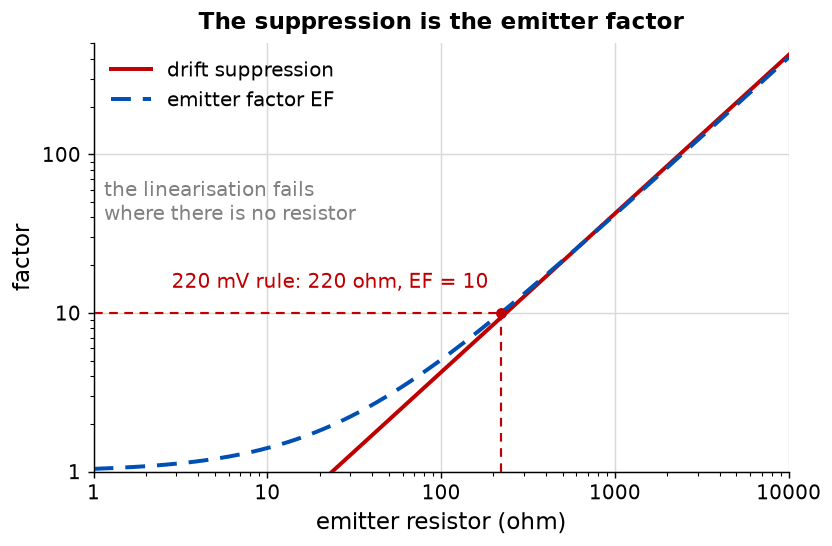

# Appendix B - Thermal drift, the emitter resistor, and what to build
The problem the emitter resistor solves, an argument for it that does not work, and the one that
does.

---

## B.1 The problem
A transistor's base-emitter voltage falls about 2 mV per degree at a fixed collector current,
because the saturation current rises steeply with temperature and drags $V_{BE}$ down.

Turn that around. **At a fixed base-emitter voltage the collector current rises about 8 per cent
per degree,** because $e^{2/26} - 1 = 0.08$.

<!-- value: 8 = 100.0 * drift_without_degeneration() -->


**Over a thirty-degree rise that is a factor of ten.** A stage biased at 1 mA on a bench at 20
degrees is at 10 mA inside an enclosure at 50, sitting hard against one end of its load line.

---

## B.2 An argument that does not survive its own numbers
A tempting way to explain what the emitter resistor does:
1. A one degree rise lifts the collector current by about 10 per cent, from 1.06 mA to 1.17.
2. The emitter voltage rises with it, by a tenth of the 1.06 V it was already dropping, so by
   about 100 mV.
3. The base is held by the divider, so the base-emitter voltage falls by that same 100 mV, from
   0.65 V to about 0.55.
4. A lower base-emitter voltage means less current, so the operating point is restored.

Every step follows from the one before it, the conclusion is correct, and the argument is wrong.

**The 10 per cent is right and the rest does not follow.** 100 mV below 0.65 V, at 60 mV a decade:

$$\frac{I_C(0.55)}{I_C(0.65)} = e^{-0.100/0.026} = \frac{1}{47}$$

**The collector current would fall by a factor of 47, not by 10 per cent.** The circuit never
reaches that state: long before the emitter has risen 100 mV the current has been pulled back. The
argument describes a system that overshoots wildly and calls it stable. What is wrong is not the
physics but the size of the step: **it applies an open-loop change to a closed-loop circuit.**

---

## B.3 What actually happens
The emitter resistor is a **local feedback loop**, and the right way to analyse it is L04's.

The base is held by a stiff divider. The disturbance is $V_{BE}$ drifting down at 2 mV per degree,
equivalent to the base being driven 2 mV *up*. The emitter follows within a few millivolts, so the
emitter voltage rises 2 mV, and

$$\Delta I_C = \frac{2\ \text{mV}}{R_E} = \frac{2\ \text{mV}}{1\ \text{k}\Omega} = 2\ \mu\text{A}$$

On 0.93 mA that is **0.21 per cent per degree,** against 8 per cent without the resistor, and the
base-emitter voltage moves by about 2 mV rather than 100. **The suppression factor is the loop
gain:**

$$1 + \frac{R_E}{r_e} = 1 + \frac{1000}{28} = 37$$



**That number is the emitter factor,** which L07 introduces as the thing that decides gain. The
emitter resistor divides the drift by exactly the factor by which it reduces the gain: **stability
costs gain, one for one.** B.2's story of voltages in sequence has no place to put a loop gain.

---

## B.4 The 220 millivolt rule
Enough emitter resistance for the suppression wanted and no more, since every ohm costs gain. A
good rule is to drop about 220 mV across it:

$$R_E = \frac{220\ \text{mV}}{I_C}$$

At 1 mA that is 220 ohm, an E12 value exactly; at 10 mA it is 22 ohm; at 20 mA, 11 ohm. The rule
is chosen so that the answer lands on the E12 grid across the decade of currents this course uses.

<!-- value: 220 = nearest_e12(degeneration_resistor(1e-3)) -->

$$EF = \frac{r_e + R_E}{r_e} = \frac{26 + 220}{26} = 9.5$$

<!-- value: 9.5 = emitter_factor(1e-3, 220.0) -->

A decade of drift suppression bought with a decade of gain. **22 mV would give 1.85,** barely any
suppression; **2.2 V would give 85,** and a stage divided by 85 is not an amplifier worth having.

---

## B.5 What to build
### `ael/bias/point.hpp`
```cpp
namespace ael::bias
{
struct Point
{
    double baseVoltage{};
    double emitterVoltage{};
    double collectorVoltage{};
    double collectorCurrent{};
};

/// The quiescent point of a divider-biased stage, including the base current's droop.
[[nodiscard]] Point quiescentPoint(double supply, double upper, double lower, double emitter,
                                   double collector, double beta = 50.0, double vbe = 0.65) noexcept;

/// Divider current over base current. Ten is the usual rule of thumb.
[[nodiscard]] double stiffness(double supply, double upper, double lower,
                               double collectorCurrent, double beta = 50.0) noexcept;

[[nodiscard]] double driftWithoutDegeneration() noexcept;
[[nodiscard]] double driftWithDegeneration(double collectorCurrent, double emitterResistor) noexcept;
[[nodiscard]] double driftSuppression(double collectorCurrent, double emitterResistor) noexcept;
[[nodiscard]] double degenerationResistor(double collectorCurrent, double drop = 0.220) noexcept;
}
```

`quiescentPoint` must account for the droop of
[A.3](./a_the_quiescent_point.md#a3-the-base-current-loads-the-divider). It is self-referential, so
solve it: two or three fixed-point iterations converge, and a closed form exists if you prefer.

**Put the emitter current, not the collector current, through the emitter resistor.** Once the base
current is in the calculation it is in both places, so $I_E = (\beta + 1)I_B$ and
$emitterVoltage = I_E R_E$. At $\beta = 50$ the difference is two per cent, 19 mV here, and the
shipped suite checks it to a tenth of a millivolt.

### Temperature in `ael/device/bjt.hpp`
Add a `temperature` in kelvin to `Parameters`, defaulting to 300.15, and make both the thermal
voltage and the saturation current depend on it:

$$V_T = \frac{kT}{q}, \qquad
I_S(T) = I_S(T_0)\left(\frac{T}{T_0}\right)^3 \exp\left[\frac{E_g q}{k}\left(\frac{1}{T_0}-\frac{1}{T}\right)\right]$$

with $E_g = 1.11$ eV. **That is where the $-2$ mV per degree comes from; it is not put in by hand.**

**The two together give about $-1.77$ mV per degree at 1 mA,** not exactly $-2$. The round figure is
what every textbook quotes and what to calculate with; the physics gives a number that depends on
the current, and the Cross-check is partly about that difference.

### What good looks like
About sixty lines. The temperature addition is six.

---

## B.6 What this appendix is blind to
* **Self-heating.** The transistor's own dissipation raises its temperature, so drift is partly a
  loop through the package. Negligible here; dominant in L08's output stage.
* **The divider's own temperature coefficient.** Resistors drift about 100 parts per million per
  degree, a hundredth of the transistor, and are ignored.
* **Beta's temperature coefficient.** It rises about 0.5 per cent per degree, moving the droop of
  [A.3](./a_the_quiescent_point.md#a3-the-base-current-loads-the-divider): second order on first.

---
