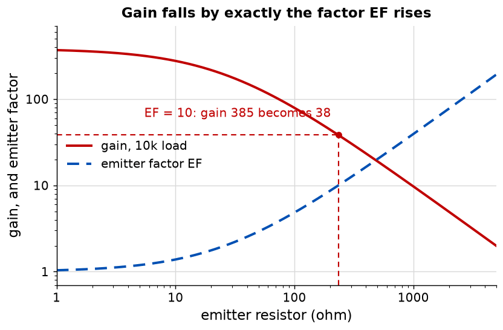

# Appendix A - The small-signal model, and the three results

The centre of the course. One resistance, one construction, three results, and the same method
every time.

---

## A.1 A straight line through a curve

A transistor's collector current is exponential in its base-emitter voltage. That is not a
relationship anyone wants to design with.

But an amplifier does not use the whole curve. It sits at an operating point, found in
[L06](../../L06/README.md), and the signal moves it a little way either side. **Over a small
enough excursion, any smooth curve is a straight line**, and the slope of that line at the
operating point is the entire content of a small-signal model.

$$g_m = \left.\frac{dI_C}{dV_{BE}}\right|_{Q} = \frac{I_C}{V_T}$$

**How small is small enough** is worth answering once. The exponential's scale is $V_T$, 26 mV, so
an excursion of a few millivolts is linear to a fraction of a per cent and an excursion of 26 mV
is not linear at all. A stage handling 10 mV of base signal is already distorting noticeably, and
that is the mechanism L04's feedback was dividing down.

**What linearising discards:** clipping, distortion, the fact that the device turns off, and any
signal large enough to move the operating point. The model is exact for infinitesimal signals and
useful for small ones, and "small" means small compared with 26 mV.

---

## A.2 The one resistance

The reciprocal of that slope is a resistance, and it is the quantity this whole course is written
in terms of:

$$r_e = \frac{V_T}{I_C} = \frac{26\ \text{mV}}{I_C}$$

At 1 mA it is 26 ohm.

<!-- value: 26 = intrinsic_emitter_resistance(1e-3) -->

**It is not a resistor.** It is the slope of the device's own exponential at the operating point.
It depends on nothing but the current and the temperature, it cannot be bought or specified, and
if the stage is switched off it does not become large, it ceases to exist along with the operating
point that defined it.

This course uses it in preference to $g_m$ throughout, on the grounds that a resistance in
series with the emitter is easier to reason about than a transconductance. The translation is one
line, $g_m = 1/r_e$, and every result here can be rewritten in the other convention by
substitution.

---

## A.3 Building the small-signal schematic

Four rules, applied in order, turn a stage into something analysable:

1. **Every DC source becomes a short to ground.** A rail that does not move carries no signal.
2. **Every coupling and bypass capacitor becomes a short.** They were chosen to be short at the
   signal frequency; that is what they are for.
3. **The bias network disappears** wherever it is now in parallel with something much smaller.
4. **The transistor becomes $r_e$ from base to emitter, and a current source from collector to
   emitter** carrying the current that $r_e$ passes.

The result has no transistor in it. It has one resistance, one current source, and the external
resistors, and every result below falls out of walking round it.

**The one equation in the model** is the link between the two halves: the current the input drives
through $r_e$ and $R_E$ *is* the current the collector source delivers. Everything else is
bookkeeping.

---

## A.4 Three results, one method

**Gain.** The input drives a current $v_{in}/(r_e + R_E)$ through the emitter branch. That current
comes out of the collector and flows through $R_C$, producing $-i R_C$ at the output. So

$$A_v = -\frac{R_C}{r_e + R_E}$$

The minus sign is real: the stage inverts, because more base voltage means more collector current
means a lower collector voltage.

For 10 kilohm and 1 mA with no emitter resistor that is $-385$; with 234 ohm it is $-38.5$.

<!-- value: 385 = abs(ce_gain(10e3, 1e-3)) -->

**Input resistance.** Looking into the base, the current drawn is the emitter current divided by
$\beta$, and the voltage is that current times the emitter branch:

$$Z_{in(base)} = \beta\,(r_e + R_E)$$

At 1 mA with 234 ohm and $\beta = 50$ that is 13 kilohm. **This is the one result in Part 2 that
depends on beta**, and [L05 A.2](../../L05/appendix/a_the_bipolar_transistor.md#a2-beta-and-why-this-course-assumes-50)
warned that it would be. It is why an input resistance is always a range rather than a number.

The stage's actual input resistance is that in parallel with the bias divider, and the divider is
usually the smaller of the two.

**Output resistance** is the subject of [Appendix B](./b_the_emitter_factor.md), because it is
the one result in this lecture that the obvious answer gets wrong.

---

## A.5 What the emitter resistor does to the gain

Dividing the two gain expressions:

$$\frac{A_v(\text{no } R_E)}{A_v(\text{with } R_E)} = \frac{r_e + R_E}{r_e}$$

That ratio is the **emitter factor**, and the gain falls by exactly it.

An emitter resistor is therefore not free, and it is not cheap either: **it costs gain one for
one**. What it buys was L06's subject, thermal stability, and what else it buys is
[Appendix B](./b_the_emitter_factor.md)'s.

**Bypassing it** with a capacitor recovers the gain at signal frequencies while keeping the DC
stability, which is the standard compromise and the reason almost every discrete common-emitter
stage has a capacitor across its emitter resistor. It also throws away the distortion reduction,
because that was feedback and the capacitor removed it at exactly the frequencies the signal
occupies.

---

## A.6 What this appendix is blind to

* **Everything nonlinear.** Distortion, clipping and slew rate are all outside a model built by
  assuming a straight line.
* **Capacitance.** Nothing here has a frequency in it. The Miller effect of
  [B.5](./b_the_emitter_factor.md#b5-miller-and-the-cascode) is where that starts.
* **The Early effect**, so far. $r_o$ arrives in [B.2](./b_the_emitter_factor.md#b2-the-early-effect-and-r_o)
  and changes the output resistance results and nothing else.
* **Noise.** A small-signal model describes what a stage does to a signal, and says nothing about
  the signal the stage adds on its own.

---
