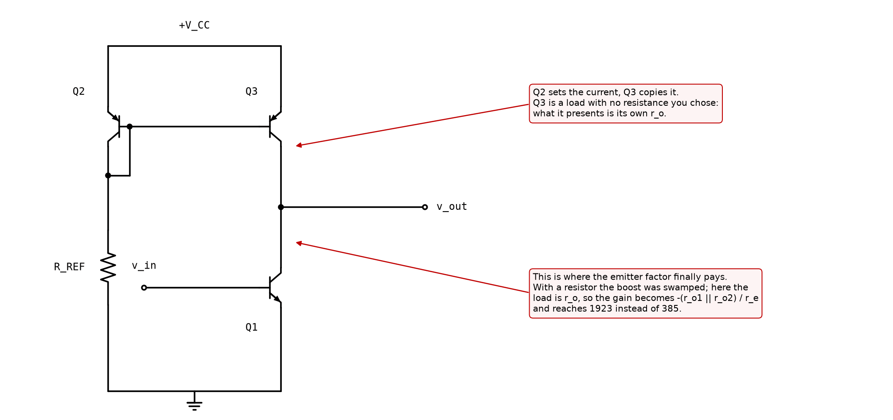
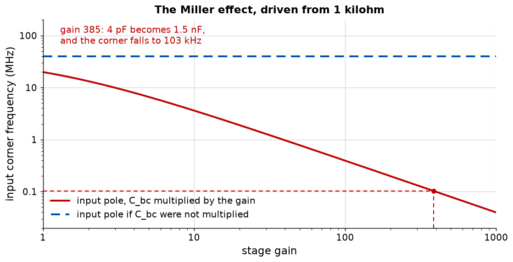
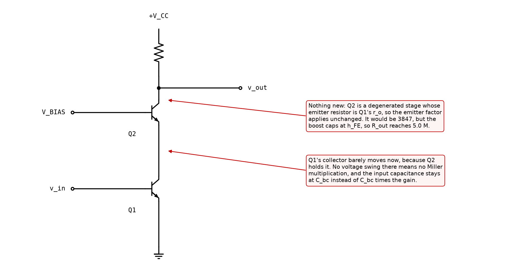

# Appendix B - The emitter factor, and where it belongs

The organising idea of this whole treatment, the node it belongs to, and the three circuits that
follow from getting that right.

---

## B.1 The emitter factor

$$EF = \frac{r_e + R_E}{r_e}$$

It is the factor by which a degeneration resistor raises the *total* emitter resistance, and it
earns its place in this course by answering two questions with one number:

* By what factor does the stage's **gain fall**?
* By what factor does the **resistance it presents rise**?

**The gain half is exactly right**, and [A.5](./a_the_small_signal_model.md#a5-what-the-emitter-resistor-does-to-the-gain)
derived it: the gain falls by exactly $EF$.

**The second half is the one worth being careful about.** The obvious reading is that the *stage's
output resistance* rises by $EF$, and that reading is wrong for a reason that is arithmetic rather
than physical. [B.3](#b3-where-the-emitter-factor-actually-belongs) is that argument, and getting
it right is what makes the rest of Part 2 make sense.

The sizing rule of [L06](../../L06/README.md) puts 220 mV across the resistor and gives
$EF \approx 10$ at any current in the range this course uses.

---

## B.2 The Early effect and r_o

A transistor's collector current is not perfectly independent of its collector voltage. Extending
the collector-base depletion region shortens the base, which raises the current slightly. The
effect is described by one parameter, the Early voltage:

$$r_o = \frac{V_A}{I_C}$$

With $V_A = 100$ V and 1 mA that is 100 kilohm.

<!-- value: 100 = early_resistance(1e-3) / 1e3 -->

Until now this could be ignored: it changes the gain of a resistively loaded stage by under a per
cent. From here it cannot, because it is the entire subject of the next three sections.

---

## B.3 Where the emitter factor actually belongs

The tempting way to write the stage's output resistance is

$$R_{out} \approx R_C \cdot EF$$

**That cannot be right, and the reason is arithmetic rather than physics.** The output resistance
of a common-emitter stage is the collector resistor in parallel with whatever the transistor
presents at that node. A parallel combination is always smaller than either part. So **no amount
of degeneration can raise a stage's output resistance above $R_C$**, and $R_C \cdot EF$ is ten
times larger than $R_C$.

What degeneration does raise is the resistance **looking into the collector**, with the collector
resistor removed:

$$R_{into\ collector} = r_o\left[1 + g_m (R_E \parallel r_\pi)\right] + (R_E \parallel r_\pi)$$

and *that* is very nearly $r_o \cdot EF$. At 1 mA with 234 ohm it is 863 kilohm against
$r_o \cdot EF$ of 1000 kilohm, which is the factor arriving at the node it belongs to.

The stage's output resistance is then

$$R_{out} = R_C \parallel R_{into\ collector} = 10\ \text{k} \parallel 863\ \text{k} = 9.89\ \text{k}\Omega$$

<!-- value: 9.89 = ce_output_resistance(10e3, 1e-3, 234.0) / 1e3 -->

against **9.09 kilohm** for the same stage with no emitter resistor at all.

**So with a resistive load, degeneration buys 9 per cent of output resistance, not a factor of
ten.** The boost is real and it is invisible, because $R_C$ swamps it.

---

## B.4 Which is exactly why a current-mirror load exists

The correction is not merely a correction. It supplies the reason the next two lectures exist.

If the boost is being thrown away by $R_C$, the answer is to stop using $R_C$. A **current mirror**
as a load presents its own $r_o$ instead of a resistor you chose, and $r_o$ is 100 kilohm rather
than 10.

| Load               | Output resistance, no $R_E$ | With $R_E$ for $EF = 10$ |
| ------------------ | --------------------------- | ------------------------ |
| 10 kilohm resistor | 9.09 kilohm                 | 9.89 kilohm              |
| Current mirror     | 50 kilohm                   | 89.6 kilohm              |

<!-- value: 89.6 = ce_output_resistance(early_resistance(1e-3), 1e-3, 234.0) / 1e3 -->

With a mirror the degeneration nearly doubles the output resistance, and since gain is the output
resistance times $g_m$, it nearly doubles the gain too.

**A mirror load raises the gain for two independent reasons**, and they are worth separating
because they are easy to run together:

* **Its own $r_o$ is large**, so the stage's output node is loaded by 100 kilohm instead of 10.
  This has nothing to do with degeneration.
* **It stops the degeneration boost being swamped.** This is the emitter factor finally paying.

The gain of the resistively loaded stage was 385. With a mirror load it is 1923, five times more,
from the first mechanism alone.

<!-- value: 1923 = abs(ce_gain_exact(early_resistance(1e-3), 1e-3)) -->

---

## B.5 Miller and the cascode

A stage with voltage gain has a problem its DC analysis cannot see. The collector-base capacitance
bridges input to output, and the output moves the other way by the gain, so the input sees

$$C_{in} = C_{bc}(1 + |A_v|)$$

Four picofarads across a stage with a gain of 385 is **1.5 nanofarads** at the input.

<!-- value: 1.5 = miller_capacitance(ce_gain(10e3, 1e-3)) * 1e9 -->

Driven from 1 kilohm that is a corner at **103 kHz**, on a device good to hundreds of megahertz.
The Miller effect, not the transistor, is what limits an ordinary common-emitter stage.

**The cascode is the answer, and it is a stage you have already analysed.**

Put a second transistor above the first with its base held fixed. The lower transistor's collector
now sits at a nearly constant voltage, because the upper transistor holds it there. **No voltage
swing at that node means no Miller multiplication**, and the input capacitance stays at $C_{bc}$.

And the output resistance:

$$R_{out(cascode)} = r_o\left[1 + g_m(r_o \parallel r_\pi)\right] + \dots \approx \beta r_o = 5\ \text{M}\Omega$$

<!-- value: 5.04 = cascode_output_resistance(1e-3) / 1e6 -->

**which is [B.3](#b3-where-the-emitter-factor-actually-belongs)'s expression with $R_E = r_o$.** A
cascode is a degenerated stage whose degeneration resistor happens to be another transistor's
output resistance. The emitter factor that would apply is 3847; the boost caps at $\beta$, because
$r_\pi$ shunts the degeneration, so it reaches 5.04 megohm against a $\beta r_o$ ceiling of 5.00.

**No new machinery**, which is the best argument this course has for teaching the emitter factor
as an idea rather than a formula.

---

## B.6 The MOSFET, in one substitution

No textbook gives the MOSFET a quantity that behaves as $r_e$ does, so this course names one:

$$r_s = \frac{1}{g_m}$$

With $r_s$ named, every result in this appendix transfers by writing $r_s$ for $r_e$:

$$A_v = -\frac{R_D}{r_s + R_S}, \qquad SF = \frac{r_s + R_S}{r_s}$$

and the 220 mV sizing rule is unchanged.

**The one exception is input resistance.** A gate draws no current, so there is no
$\beta(r_e + R_E)$ term to carry over; a common-source stage's input resistance is its bias
network and nothing else. That is a simplification, and it is the reason L09's input stage and
L10's inter-stage buffer are both MOSFETs.

**Why $SF \approx 2$ where $EF \approx 10$.** Both from 220 mV across the degeneration resistor.
$r_s$ at 1 mA is 250 ohm where $r_e$ is 26, because a MOSFET's transconductance is about ten times
lower ([L05 B.2](../../L05/appendix/b_the_mosfet_and_what_to_build.md#b2-transconductance-and-the-factor-of-ten)).
So the same 220 mV is 8.5 times $r_e$ and only 0.9 times $r_s$. The correspondence is exact, and
that is where it comes from.

---

## B.7 What to build

### The Early effect in `ael/device/bjt.hpp`

Multiply the forward transport current by $(1 + V_{CE}/V_A)$. `earlyVoltage` has been sitting in
`Parameters` since L05 doing nothing; this is where it starts working, and it is what makes $r_o$
finite and every result in [B.3](#b3-where-the-emitter-factor-actually-belongs) measurable.

**Multiply the collector current only. The base current does not get the factor**, so $h_{FE}$
comes out as $\beta_F(1 + V_{CE}/V_A)$ and rises with the collector voltage, which is why a
datasheet's beta curve slopes.

That placement is not a detail. Putting the factor on the whole transport current instead, so that
both currents scale together and beta stays flat, is tempting because it leaves L05's contract
untouched. It also makes the base inject extra current into the emitter as the collector rises,
which is degeneration acting through $R_E$, and the resistance looking into the collector comes
out **18 per cent high** and *above* the emitter factor rather than below it. The shunting
argument of [B.3](#b3-where-the-emitter-factor-actually-belongs) would then be contradicted by
your own solver. One test in the suite exists to catch that version.

**One number to expect that the lecture does not quote.** Differentiating the factor gives
$r_o = (V_A + V_{CE})/I_C$, not $V_A/I_C$. At a collector sitting 5 V up that is 105 kilohm rather
than 100. Every closed form in this appendix uses the round figure, and the 5 per cent is one of
the things the Cross-check's legs will disagree about.

### `ael/ssm/model.hpp`

| Function                                    | Returns                                                                 |
| ------------------------------------------- | ----------------------------------------------------------------------- |
| `intrinsicEmitterResistance(ic)`            | $V_T/I_C$.                                                              |
| `intrinsicSourceResistance(gm)`             | $1/g_m$.                                                                |
| `emitterFactor(ic, re)`                     | $(r_e + R_E)/r_e$.                                                      |
| `sourceFactor(gm, rs)`                      | The same, for a MOSFET.                                                 |
| `gain(rc, ic, re)`                          | $-R_C/(r_e + R_E)$.                                                     |
| `inputResistance(ic, re, beta)`             | $\beta(r_e + R_E)$.                                                     |
| `resistanceIntoCollector(ic, re, beta, va)` | The expression of [B.3](#b3-where-the-emitter-factor-actually-belongs). |
| `outputResistance(rc, ic, re, beta, va)`    | That, in parallel with the load.                                        |
| `cascodeOutputResistance(ic, beta, va)`     | `resistanceIntoCollector` with $R_E = r_o$.                             |
| `millerCapacitance(gain, cbc)`              | $C(1 + \lvert A \rvert)$.                                               |

**`cascodeOutputResistance` must be implemented by calling `resistanceIntoCollector`**, not by a
separate formula. If it is a separate formula, the lecture's central claim, that a cascode is
degeneration by $r_o$, is an assertion rather than something the code demonstrates.

### What good looks like

About seventy lines, of which none is longer than three.

---

## B.8 What this appendix is blind to

* **The body effect**, which raises a MOSFET follower's effective threshold and costs real gain in
  L08.
* **Base resistance.** A real transistor has ohmic resistance in the base, which adds to $r_e$ at
  high current and limits noise performance. Absent here.
* **Beta's dependence on the collector voltage.** The Early effect that makes $r_o$ finite also
  makes $h_{FE}$ rise with $V_{CE}$, which is why a datasheet's beta curve slopes. The model built
  here scales both currents together and so keeps beta flat, as [B.7](#b7-what-to-build) says.
* **The second Miller capacitance.** The base-emitter capacitance is not multiplied but is far
  larger, and at high frequency it, not $C_{bc}$, sets the limit.
* **Anything at high frequency, properly.** One capacitance and one pole is a caricature of a
  device with three capacitances and a transit time.

---
