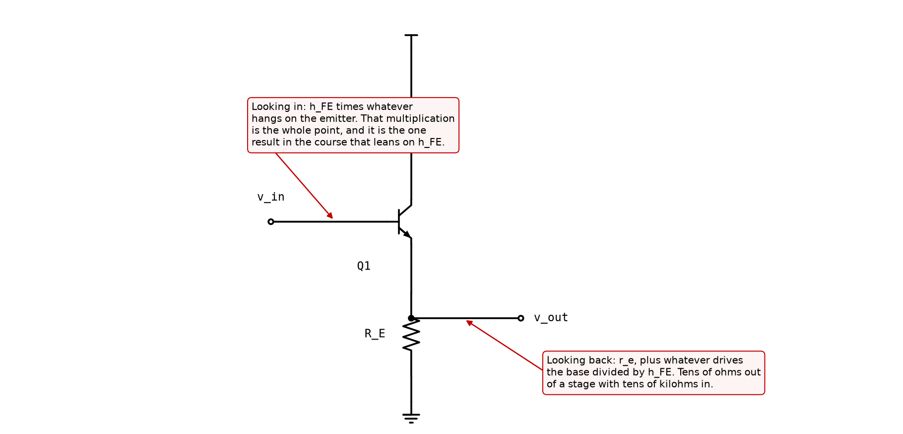
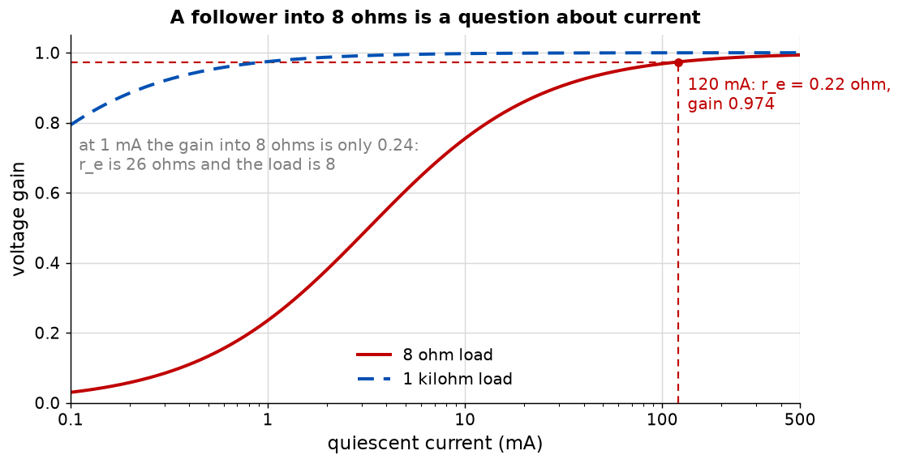

# Appendix A - The follower, and the load it exists to survive

A stage with a voltage gain of one, and the arithmetic that makes it the most-used circuit in the
course.

---

## A.1 The same model, at the other terminal

Nothing new is derived here. [L07's model](../../L07/appendix/a_the_small_signal_model.md) is
$r_e$ from base to emitter and a current source from collector to emitter; a **follower** is that
model with the output taken at the emitter instead of the collector, and with the collector
resistor removed because it now has no job.

Three differences from the common-emitter stage, and the third is only a convention:

1. **The output is at the emitter**, not the collector.
2. **There is no collector resistor**, because a follower does not turn current into voltage.
3. In high-voltage work the collector is sometimes tied to ground rather than the rail, which
   protects the device and changes none of the results below.

---

## A.2 Gain, and where the missing part went

The input drives $r_e$ and $R_E$ in series; the output is taken across $R_E$ alone. That is a
divider:

$$G = \frac{R_E}{r_e + R_E}$$

**Always less than one, and the shortfall is $r_e/(r_e + R_E)$.** At 1 mA into 10 kilohm it is
0.997, a loss of 0.26 per cent. At 120 mA into an 8 ohm loudspeaker it is **0.974**, a loss of
2.6 per cent.

<!-- value: 0.974 = follower_gain(0.12, 8.0) -->

Both numbers are the same expression, and the difference between them is the ratio $r_e/R_E$.
That ratio is the only thing a follower's gain depends on, and there is exactly one lever on it:

$$r_e = \frac{V_T}{I_C}$$

so **the gain is a question about current**, and about nothing else. A follower that is not good
enough is a follower that is not biased hard enough.

**Read the 8 ohm curve at 1 mA: the gain is 0.24.** Not 0.99, not 0.9, but a quarter. $r_e$ is 26
ohm and the load is 8, so three quarters of the signal is dropped inside the transistor. That
single number is why [Appendix B](./b_the_output_stage.md) exists, and it is why an output stage
idles at 120 mA rather than at the half milliamp a small-signal stage uses.

---

## A.3 The two resistances, which are the point

**Looking into the base**, the base current is the emitter current divided by $h_{FE}$, so

$$Z_{in} = h_{FE}\,(r_e + R_E)$$

**Looking back into the emitter**, the transistor presents $r_e$, and whatever resistance drives
the base appears divided by $h_{FE}$:

$$Z_{out} = r_e + \frac{R_{source}}{h_{FE}}$$

At 1 mA driven from 1 kilohm that is $26 + 20 = 46$ ohm.

<!-- value: 46 = follower_output_resistance(1e-3, 1e3) -->

**Put the two together and the stage is an impedance transformer.** It takes what is on its
emitter and shows the driving stage $h_{FE}$ times more; it takes what is driving its base and
shows the load $h_{FE}$ times less. It does this while passing the signal through at a gain of
0.97, which is the entire trick.

**And both results are proportional to $h_{FE}$**, which
[L05 A.2](../../L05/appendix/a_the_bipolar_transistor.md#a2-beta-and-why-this-course-assumes-50)
warned about and [L07 A.4](../../L07/appendix/a_the_small_signal_model.md#a4-three-results-one-method)
warned about again. The two results this course leans on beta for are both in this appendix. Keep
that in view; [A.5](#a5-the-darlington-and-the-price-of-beta-squared) is where it starts to hurt.

---

## A.4 The eight ohm problem

Take the stage of [L07](../../L07/README.md): 1 mA, 10 kilohm collector resistor, 234 ohm emitter
resistor. Its open-circuit gain is 38.5 and its output resistance is 9.89 kilohm. Connect a
loudspeaker.

$$G_{loaded} = G \cdot \frac{R_{load}}{R_{out} + R_{load}} = 38.5 \times \frac{8}{9885 + 8}$$

**0.031.** The stage keeps **0.08 per cent** of its gain, and the amplifier does not work at all.

<!-- value: 0.08 = 100 * 8.0 / (ce_output_resistance(10e3, 1e-3, 234.0) + 8.0) -->

**Now put a follower in between**, biased at 120 mA. Looking into its base:
$h_{FE}(r_e + R_{load}) = 50 \times 8.22 = 411$ ohm. The driving stage now sees 411 instead of 8,
and keeps **4 per cent**.

Four per cent is better by a factor of fifty and it is still useless. **One follower is not
enough**, and that is not a small shortfall to be tuned away; it is two orders of magnitude.

---

## A.5 The Darlington, and the price of beta squared

Two transistors, the first driving the base of the second, behave as one device with a current
gain of $h_{FE1} h_{FE2}$ and two base-emitter drops instead of one. The multiplication in
[A.3](#a3-the-two-resistances-which-are-the-point) then happens twice:

$$Z_{in} = h_{FE}^2\,(2r_e + R_{load}) = 2500 \times 8.43 = 21.1\ \text{k}\Omega$$

<!-- value: 21.1 = darlington_input_resistance(0.12, 8.0) / 1e3 -->

**The resistance the square multiplies is the pair's own $2r_e$**, not one device's $r_e$. The
input device runs at the output device's base current, so its $r_e$ is $h_{FE}$ times larger, and
it is seen through the output device's gain, so it contributes $r_e$ again. The two $h_{FE}$s
cancel and a Darlington's effective emitter resistance is **exactly twice** a single transistor's,
whatever $h_{FE}$ is.

The driving stage now sees 21.1 kilohm against its own 9.89, and keeps **68 per cent**. That is a
working amplifier, and it is the reason essentially every discrete output stage is a Darlington or
something like one.

**Now the bill.** Read the shaded band on the figure. With $h_{FE} = 20$ the input resistance is
3.4 kilohm and the stage keeps 25 per cent; with $h_{FE} = 200$ it is 337 kilohm and the stage
keeps 97. **The same design, built from the same part number, has a gain that varies by a factor
of nearly four across an ordinary production spread.**

<!-- value: 25 = 100 * darlington_input_resistance(0.12, 8.0, 20.0) / (ce_output_resistance(10e3, 1e-3, 234.0) + darlington_input_resistance(0.12, 8.0, 20.0)) -->

That is not a design. It is a design **plus** something that removes the dependence, and the
something is [L04's feedback](../../L04/README.md): wrap a loop around the whole amplifier with a
loop gain of a few hundred and the closed-loop gain stops caring what the open-loop gain was. The
course has now met the reason operational amplifiers are built the way they are from two
directions, and this is the second. L10 builds the loop.

**The Darlington's other costs**, which are real and are not solved by feedback:

* **Two base-emitter drops**, so the output swing is 1.3 V short of each rail rather than 0.65.
* **Slow turn-off**, because the second transistor's base charge has nowhere to go. A resistor
  from that base to the emitter is the standard fix and it appears in every practical circuit.
* **Twice the thermal drift** in the bias, which [B.4](./b_the_output_stage.md#b4-thermal-runaway-and-a-fix-that-looks-like-nothing)
  has to deal with.
* **Twice the intrinsic emitter resistance**, so its own gain is 0.949 into 8 ohms where a single
  follower gives 0.974. Small, and it is the same doubling as the input resistance, seen from the
  other side.

---

## A.6 The fifth time

This is the same arithmetic the course has been running since L01, and it is worth listing all
six occurrences in one place, because the point is that there is only one idea here. This lecture
is the fifth; [L10](../../L10/README.md) is the last:

| Where                                                                                                | What loaded what                         | Cost                           |
| ---------------------------------------------------------------------------------------------------- | ---------------------------------------- | ------------------------------ |
| [L01 A.6](../../L01/appendix/a_circuits_and_units.md#a6-loading-and-why-it-decides-everything-later) | 10 kilohm on a divider                   | a third of the output          |
| [L02](../../L02/README.md)                                                                           | source resistance on a filter            | the corner moves 6.6 times     |
| [L03](../../L03/README.md)                                                                           | two filter sections on each other        | the corner moves 1.72 times    |
| [L06 A.3](../../L06/appendix/a_the_quiescent_point.md#a3-the-base-current-loads-the-divider)         | base current on a bias divider           | 12 per cent of $I_C$           |
| **L08, here**                                                                                        | **a loudspeaker on a voltage amplifier** | **99.92 per cent of the gain** |
| L10, when it is written                                                                              | each stage on the one before             | 11 dB of open-loop gain        |

**The subtraction is identical every time.** What changes is how much it costs, and here it costs
everything.

---

## A.7 What this appendix is blind to

* **Frequency.** A follower is not unconditionally stable: with a capacitive load and an inductive
  source it can oscillate, which is what the base resistor in every real output stage is for.
  Nothing here has a frequency in it.
* **Large signals.** The gain of 0.974 is a small-signal number taken at one operating point. A
  follower driven towards its rails runs out of current long before it runs out of voltage, and
  [Appendix B](./b_the_output_stage.md) is about what to do instead.
* **The second transistor's own operating point** in the Darlington. It runs at the first's base
  current, which is fifty times smaller, so its $r_e$ is fifty times larger. Included in the
  code, ignored in the arithmetic above.
* **Power.** A device carrying 120 mA at 20 V is dissipating 2.4 W, which is a heatsink question
  and not a small-signal one.

---
