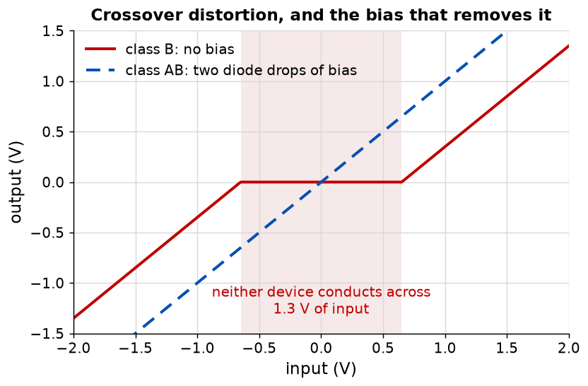
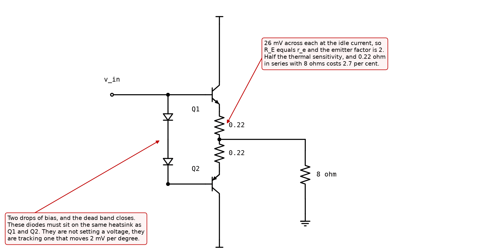

# Appendix B - The output stage, and the model that finally breaks

Three classes, one dead band, one sizing rule, and the first place in this course where the
constant-drop model is not merely approximate but wrong by a factor of sixty.

---

## B.1 Class A: the follower you already have

Bias the follower so that it conducts for the whole signal. That is **class A**, and
[Appendix A](./a_the_follower.md) is a complete description of it.

Its virtue is that nothing ever turns off, so there is no discontinuity anywhere in the transfer
curve and the distortion is whatever the exponential's curvature gives.

Its vice is arithmetic. To swing $\pm V$ into a load, the device must idle at $V/R_{load}$,
because that is the current it has to be able to *stop* delivering at the negative peak. So it
sits there burning $V^2/R_{load}$ at idle, and the best a resistively loaded class-A stage can do
is **25 per cent efficiency at full output**, falling to zero as the signal falls. A 100 W class-A
amplifier draws 400 W with no signal playing and warms the room.

That is not always wrong. It is wrong for a loudspeaker.

---

## B.2 Class B, and the dead band

Use two devices. An NPN follower pushes current into the load on positive half-cycles, a PNP
follower pulls it out on negative ones, and neither conducts when there is no signal. Idle
dissipation goes to zero and the theoretical efficiency rises to $\pi/4$, **78.5 per cent**.

**And it does not work**, for a reason that has nothing to do with efficiency.

Neither transistor conducts until its base-emitter junction is forward biased, so the output stays
at zero across an input band **two diode drops wide**, about 1.3 V. That flat is **crossover
distortion**.

**Its size is not the problem; its position is.** A dead band 1.3 V wide in a stage that swings
30 V is 4 per cent, which sounds tolerable. But it sits at the origin, and a music signal spends
most of its time near the origin. The distortion is therefore **worst on quiet passages and
disappears at full output**, which is the opposite of every other distortion mechanism in an
amplifier and is why it is audible far below the level its percentage suggests.

---

## B.3 Class AB, and the 26 millivolt rule

Bias the two devices so that a small current flows in both at idle. The dead band closes, and the
idle dissipation is small rather than zero. This is **class AB**, and it is what essentially every
audio output stage is.

**How much idle current?** Enough to close the dead band and no more. The rule this course uses is
about the emitter resistors rather than the current directly:

$$R_E = \frac{V_T}{I_q} = \frac{26\ \text{mV}}{I_q}$$

At the 120 mA a stage of this size idles at, that is 0.217 ohm, and 0.22 is an E12 value.

<!-- value: 0.22 = nearest_e12(quiescent_emitter_resistor(0.12)) -->

**The rule is $R_E = r_e$ stated the other way round**, because $r_e$ is $V_T/I_C$ and this puts
$V_T$ across $R_E$. So the emitter factor of [L07](../../L07/appendix/b_the_emitter_factor.md) is
exactly 2, and that is what the rule is choosing:

|                                         | Value        |
| --------------------------------------- | ------------ |
| $r_e$ at 120 mA                         | 0.217 ohm    |
| $R_E$, E12                              | 0.22 ohm     |
| Emitter factor                          | 2.0          |
| Drop across $R_E$ at idle               | 26 mV        |
| Cost in the load: 0.22 in series with 8 | 2.7 per cent |

<!-- value: 2.0 = emitter_factor(0.12, quiescent_emitter_resistor(0.12)) -->

**Two per cent of the signal, for half the thermal sensitivity.** Push the rule to 260 mV and the
emitter factor is 11 and the stage is very stable, and 2.2 ohm in series with an 8 ohm loudspeaker
has thrown away a fifth of the output power. Push it to 2.6 mV and the resistors have stopped
doing anything. The 26 mV point is where those two costs cross, and it is the same trade as L06's
220 mV rule with a different quantity being protected.

---

## B.4 Thermal runaway, and a fix that looks like nothing

An output transistor dissipates power, which warms it, which drops its $V_{BE}$ by 2 mV per
degree, which raises its idle current at a fixed bias voltage, which raises the dissipation. That
loop can run away, and a runaway output stage destroys itself in seconds.

Both junctions drift, so a bias generator that holds a fixed voltage is effectively 4 mV too
generous per degree, and that surplus lands across $2(r_e + R_E)$:

$$\frac{1}{I_q}\frac{dI_q}{dT} = \frac{2\lvert dV_{BE}/dT\rvert}{2(r_e + R_E) I_q}$$

|                      | Per degree   | Over a 30 degree rise |
| -------------------- | ------------ | --------------------- |
| No emitter resistors | 7.7 per cent | a factor of 9         |
| With the 26 mV rule  | 3.8 per cent | a factor of 3         |

<!-- value: 3.8 = 100 * class_ab_drift(0.12, nearest_e12(quiescent_emitter_resistor(0.12))) -->

**A factor of three is still a runaway**, and this is the point: the emitter resistors halve the
problem and do not solve it. The 26 mV rule buys margin, not stability.

**The fix is to make the bias voltage drift too.** Put the two bias diodes in thermal contact with
the output devices, bolted to the same heatsink, and their forward voltages fall 2 mV per degree
as well. The bias generator now produces *less* voltage exactly as the outputs need less, and the
drift cancels to first order.

**So the diodes are not setting a voltage. They are tracking one.** A designer who reads them as
"about 1.3 volts of bias" and mounts them on the circuit board next to the driver has built a
stage that is correct at 25 degrees and destroys itself at 60. This is the most common way a
first output stage fails, and nothing about the schematic shows it: the two circuits are drawn
identically.

**What real circuits use instead of two diodes** is a $V_{BE}$ multiplier: one transistor with a
resistive divider from its collector to its base, giving an adjustable multiple of a
base-emitter drop, mounted on the heatsink. Adjustable, because the tracking is never exact, for
the reasons in [B.8](#b8-what-this-appendix-is-blind-to).

---

## B.5 Where the constant-drop model finally breaks

Since [L05](../../L05/README.md) this course has used $V_{BE} \approx 0.65$ V wherever a bias
point was wanted, and reported the error each time: about 1 per cent at a few milliamps, 4 per
cent at half a microamp. Here it fails completely, and the failure is worth understanding because
it is not a matter of degree.

**What bias voltage does the stage above need to idle at 120 mA?**

$$V_{bias} = 2\left(V_{BE}(I_q) + I_q R_E\right)$$

$V_{BE}$ at 120 mA is **0.783 V**, not 0.65, because it is $V_T \ln(I_C/I_S)$ and 120 mA is
**2.2 decades** above the 0.72 mA where 0.65 V is right. The resistors add 26 mV each. So

$$V_{bias} = 2(0.783 + 0.026) = 1.619\ \text{V}$$

<!-- value: 1.619 = class_ab_bias(0.12, nearest_e12(quiescent_emitter_resistor(0.12))) -->

against the **1.353 V** the constant-drop model gives, which is 2(0.65) plus the same two resistor
drops. A 16 per cent error in the voltage.

**Now run it backwards, which is where the size shows.** Apply 1.353 V to that stage and ask what
idle current results. Not 120 mA reduced by a sixth: **1.96 mA**.

<!-- value: 1.96 = class_ab_idle_current(2.0 * (VBE_ON + 0.12 * nearest_e12(quiescent_emitter_resistor(0.12))), nearest_e12(quiescent_emitter_resistor(0.12))) * 1e3 -->

**A factor of 61.** The stage is biased into class B, the dead band is open, and the amplifier
sounds broken.

**Why here and not before.** Every earlier use of the constant-drop model computed a **current
from a voltage across a resistor**: subtract 0.65 from the base voltage, divide by $R_E$. An error
of 133 mV in a subtraction that yields 1.06 V is 12 per cent, and it enters linearly. Here the
model computes a **current from a voltage across a junction**, and 133 mV inside an exponential of
scale 26 mV is $e^{5.1}$, a factor of 166.

**The emitter resistors are what turn 166 into 61.** At 120 mA they carry 26 of the 133 mV, so the
junction sees only 107; at 2 mA they carry nothing. That asymmetry is local feedback acting where
it is needed and not where it is not, which is the same thing the 26 mV rule bought in
[B.4](#b4-thermal-runaway-and-a-fix-that-looks-like-nothing).

**The lesson is not "0.65 is wrong".** It is that a model's error is a property of the calculation
it is used in and not of the model. The same 133 mV was worth 12 per cent one lecture ago and is
worth a factor of 61 here.

**And it explains the circuit.** Two ordinary signal diodes running at a few milliamps produce
about 1.40 V, which gives an idle current of 4.8 mA rather than 120. That is why a real class-AB
stage uses an adjustable $V_{BE}$ multiplier, or diodes running at the same current as the
outputs, and not two diodes off the driver rail. Two plain diodes and an idle current of 120 mA
are in tension, and this is the resolution.

---

## B.6 The source follower, and the one thing that does not carry across

[L07 B.6](../../L07/appendix/b_the_emitter_factor.md#b6-the-mosfet-in-one-substitution) promised
that every result transfers by writing $r_s$ for $r_e$. It does here too:

$$G = \frac{R_S}{r_s + R_S}, \qquad Z_{out} = r_s$$

and the input resistance is the bias network, because a gate draws no current. **That last part is
a strict improvement**: the $h_{FE}^2$ of [A.5](./a_the_follower.md#a5-the-darlington-and-the-price-of-beta-squared),
with its factor-of-four spread, is replaced by a resistor you chose.

**The cost is the gain.** At 1 mA, $r_s$ is 250 ohm where $r_e$ is 26, so into a 1 kilohm load the
source follower gives 0.80 against the emitter follower's 0.97.

<!-- value: 0.80 = 1e3 / (1e3 + intrinsic_source_resistance(NMOS_GM_AT_1MA)) -->

Ten times the current recovers about a factor of three, because $g_m$ goes as $\sqrt{I_D}$ rather
than as $I_D$ ([L05 B.2](../../L05/appendix/b_the_mosfet_and_what_to_build.md#b2-transconductance-and-the-factor-of-ten)).
A MOSFET output stage therefore has to be biased much harder than a bipolar one for the same
gain, and that is the main reason output stages are usually bipolar.

**And here the substitution is not exact.** A MOSFET's threshold rises when its source sits above
its body, which in an integrated CMOS follower it always does because the body goes to the rail.
That is the **body effect**, and it is a source-to-body transconductance $g_{mb}$ acting in
parallel with the main one, typically 10 to 30 per cent of it. In a follower it appears as
degeneration the designer did not ask for:

$$G = \frac{R_S}{r_s(1 + \chi) + R_S}$$

With $\chi = 0.2$ the 0.80 above becomes **0.77**. It is not large, and it is the reason a
discrete source follower and a CMOS source follower do not give the same answer from the same
equation.

---

## B.7 What to build

### `ael/follower/stage.hpp`

| Function                                                     | Returns                                                                                                                        |
| ------------------------------------------------------------ | ------------------------------------------------------------------------------------------------------------------------------ |
| `gain(collectorCurrent, load)`                               | $R/(r_e + R)$.                                                                                                                 |
| `outputResistance(collectorCurrent, sourceResistance, beta)` | $r_e + R_{src}/h_{FE}$.                                                                                                        |
| `inputResistance(collectorCurrent, load, beta)`              | $h_{FE}(r_e + R)$.                                                                                                             |
| `darlingtonEmitterResistance(outputCurrent)`                 | $2V_T/I$. Twice one device's, and $h_{FE}$ cancels.                                                                            |
| `darlingtonGain(outputCurrent, load)`                        | $R/(2r_e + R)$: a little worse than a single follower.                                                                         |
| `darlingtonInputResistance(outputCurrent, load, beta)`       | $h_{FE}^2(2r_e + R)$.                                                                                                          |
| `loadedGain(unloadedGain, outputResistance, load)`           | The divider of [A.4](./a_the_follower.md#a4-the-eight-ohm-problem).                                                            |
| `intrinsicEmitterResistance(collectorCurrent)`               | $V_T/I_C$. The quantity L07 named, re-exported here so that a follower result can be written without reaching into `ael::ssm`. |

`loadedGain` is three characters of arithmetic and it is the most-used function in L10. Write it
here rather than inline at each call site, because L10 calls it eleven times.

### `ael/output/classab.hpp`

| Function                                       | Returns                                                                       |
| ---------------------------------------------- | ----------------------------------------------------------------------------- |
| `degenerationResistor(idleCurrent)`            | $V_T/I_q$: the 26 mV rule.                                                    |
| `biasVoltage(idleCurrent, emitterResistor)`    | $2(V_{BE}(I_q) + I_q R_E)$, with $V_{BE}$ from the **exponential**.           |
| `idleCurrent(bias, emitterResistor)`           | The inverse. There is no closed form.                                         |
| `driftPerDegree(idleCurrent, emitterResistor)` | The fraction of [B.4](#b4-thermal-runaway-and-a-fix-that-looks-like-nothing). |
| `transfer(input, bias, vbeOn, load)`           | The dead band of [B.2](#b2-class-b-and-the-dead-band).                        |

**`idleCurrent` must not call a constant-drop approximation.** It is the inverse of an equation
with an exponential and a linear term in it, those do not separate, and the whole of
[B.5](#b5-where-the-constant-drop-model-finally-breaks) is about what happens when you pretend
they do. Bisect in the logarithm, or use Newton with the limiter you wrote in L04.

### What good looks like

About fifty lines. `idleCurrent` is the only one with a loop in it.

---

## B.8 What this appendix is blind to

* **The tracking is never exact.** The bias generator runs at a few milliamps and the outputs at
  120, and [L06 B.5](../../L06/appendix/b_thermal_drift.md#b5-what-to-build) established that the
  temperature coefficient depends on the current. It is also on the heatsink rather than on the
  die, so it lags by seconds while the die responds in milliseconds. Both are why the multiplier
  is adjustable.
* **Self-heating**, which is the loop that makes the drift a runaway rather than a drift.
  [L06 B.6](../../L06/appendix/b_thermal_drift.md#b6-what-this-appendix-is-blind-to) named it and
  deferred it here; it is still deferred, because a thermal model is a course of its own.
* **Safe operating area.** A device passing 5 A with 40 V across it is outside the survivable
  region of any small transistor regardless of the average power, and that is what the protection
  circuitry of [Appendix C](./c_power_amplifiers.md) exists for.
* **Stability into a real loudspeaker**, which is not 8 ohms but a complex impedance that varies
  by a factor of five across the audio band and is inductive above it.
* **Distortion, quantitatively.** This appendix says crossover distortion is audible and does not
  say how many parts per million of it a given bias leaves.

---
