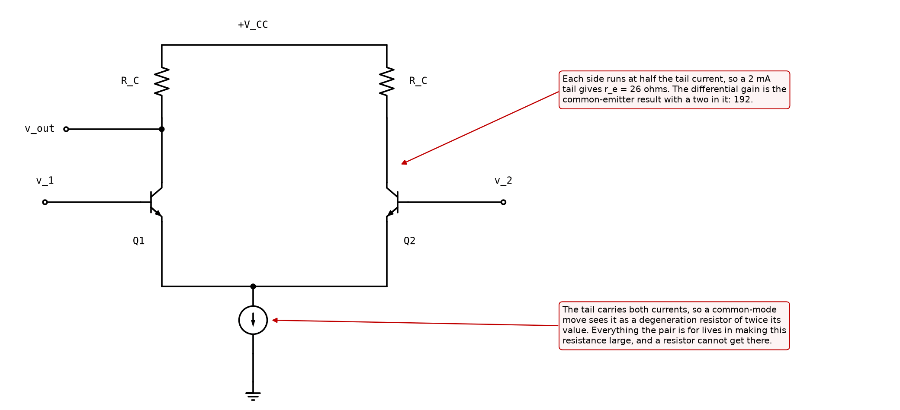
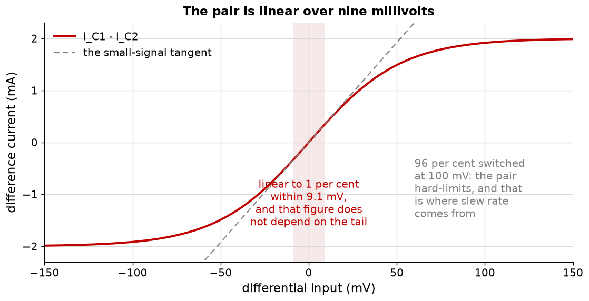

# Appendix A - The pair, the tail, and the two factors of two

The first stage in this course whose purpose is to ignore something.

---

## A.1 Two halves and one current

Two matched transistors with their emitters tied together and a **tail** current source below them.
The tail fixes the total: whatever else happens, $I_{C1} + I_{C2} = I_{tail}$. The inputs decide
only how that total is **divided**.

That is the entire circuit, and both of its properties follow from it:

* **A differential input redistributes the current** between the two halves. The tail node barely
  moves, because the sum is unchanged.
* **A common-mode input moves both halves together**, which the tail cannot supply, so the tail
  node has to move instead.

Everything in this lecture is an elaboration of those two sentences.

**Each side runs at half the tail current.** For a 2 mA tail that is 1 mA per side, so

$$r_e = \frac{V_T}{I_{tail}/2} = 26\ \Omega$$

<!-- value: 26 = diffpair_re(2e-3) -->

which is 26 ohm and not 13. Reading $r_e$ from the tail current rather than from the side current
is the commonest arithmetic slip in this lecture, and it is a factor of two on top of the two
factors of two below.

---

## A.2 Differential gain, and both factors of two

Apply $+v_d/2$ to one base and $-v_d/2$ to the other. The tail node does not move, so each half is
a common-emitter stage with its emitter at signal ground. **Exactly L07's circuit**, with no new
derivation:

$$A_1 = -\frac{R_C}{r_e} \cdot \frac{v_d/2}{v_d} = -\frac{R_C}{2 r_e}$$

For 10 kilohm and a 2 mA tail that is $-192$.

<!-- value: 192 = abs(diffpair_differential_gain(10e3, 2e-3)) -->

**Where the two comes from, and it is worth being exact about because there are two of them.**

* **The first two is the input split.** A differential input of $v_d$ puts only $v_d/2$ on each
  base. This one is unavoidable; it is what "differential" means.
* **The second two is the output.** Take the difference between the two collectors and the gain is
  $-R_C/r_e = -385$, because the two collectors move oppositely and the difference is twice
  either. Take **one** collector and you have thrown the other half away.

<!-- value: 385 = 2 * abs(diffpair_differential_gain(10e3, 2e-3)) -->

**The second two is recoverable and the first is not.** Recovering it is what the current mirror
of [B.4](./b_rejection_and_the_mirror.md#b4-the-mirror-load-and-its-two-mechanisms) does, and it
is one of the two reasons that mirror exists.

This course takes the **single-ended** output throughout, because that is what feeds the next
stage in an operational amplifier, and it says so each time a two appears.

---

## A.3 Input and output resistance

**Looking into either base**, the same result as L07 with the same factor of two:

$$Z_{in(diff)} = 2 h_{FE} r_e$$

which is 2.6 kilohm at a 2 mA tail with $\beta = 50$: the two bases in series as far as a
differential source is concerned. Low, and the reason
[B.6](./b_rejection_and_the_mirror.md#b6-offset-matching-and-why-modern-input-stages-are-mosfet)
prefers MOSFETs here.

**Looking into a collector**, the resistance is L07's `resistanceIntoCollector` with the tail as
the degeneration resistor. With a current-source tail that is enormous, so the output resistance
is $R_C$, or the mirror's $r_o$ when there is a mirror.

**And the base current is not zero**, which matters more here than anywhere else in the course.
Each base draws $I_{tail}/2\beta$, which is 20 microamps at 2 mA and $\beta = 50$. Those two
currents flow through whatever drives the two inputs, and if the two source resistances differ,
the difference becomes an input voltage the amplifier cannot distinguish from signal. That is
[B.6](./b_rejection_and_the_mirror.md#b6-offset-matching-and-why-modern-input-stages-are-mosfet)'s
subject.

---

## A.4 What the small-signal model cannot see

The two halves divide the tail current between two exponentials, and the algebra of that is a
hyperbolic tangent:

$$I_{C1} - I_{C2} = I_{tail}\tanh\!\left(\frac{v_d}{2 V_T}\right)$$

Two facts follow that no amount of small-signal analysis would have produced.

**The pair is linear over nine millivolts.** Beyond $\pm 9.1$ mV the tanh has fallen 1 per cent
below its tangent, and that is the pair's honest input range.

<!-- value: 9.1 = diffpair_linear_range(0.01) * 1e3 -->

**And that figure does not depend on the tail current at all.** The tail scales the whole curve
and cancels out of the ratio. Biasing the pair harder buys gain and buys **no linearity
whatever**, which is not what anyone expects and is worth checking in the code.

**The pair hard-limits.** At $\pm 100$ mV, 96 per cent of the tail has moved to one side and the
other side is off. Past that the output simply stops responding: not soft compression but a
ceiling.

**That ceiling is where slew rate comes from.** In an operational amplifier the pair drives a
compensation capacitor, and once the pair is fully switched the largest current it can deliver
into that capacitor is $I_{tail}$. The output then ramps at $I_{tail}/C$ volts per second and
nothing about the feedback loop can make it go faster. Slew rate is not a small-signal parameter
and this figure is why.

---

## A.5 What this appendix is blind to

* **Mismatch.** Everything here assumes the two halves are identical. They are not, and
  [B.6](./b_rejection_and_the_mirror.md#b6-offset-matching-and-why-modern-input-stages-are-mosfet)
  is about what that costs.
* **The tail's own behaviour.** Treated as ideal here; the whole of
  [Appendix B](./b_rejection_and_the_mirror.md) is about it not being.
* **Frequency.** The pair has the same Miller problem as any stage, mitigated by the fact that
  each half sees only half the signal. Not treated.
* **Noise**, which is where a differential input stage earns much of its reputation and which this
  course does not cover anywhere.

---
