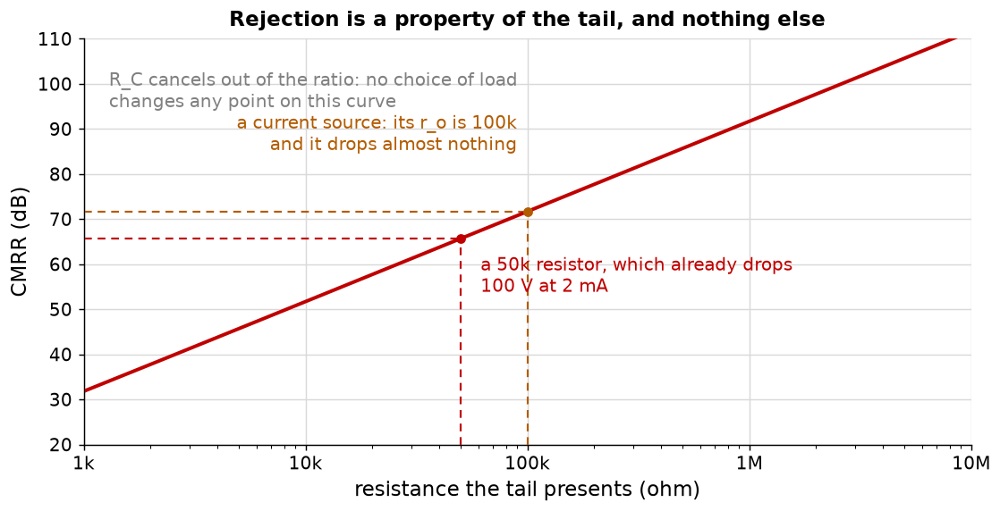
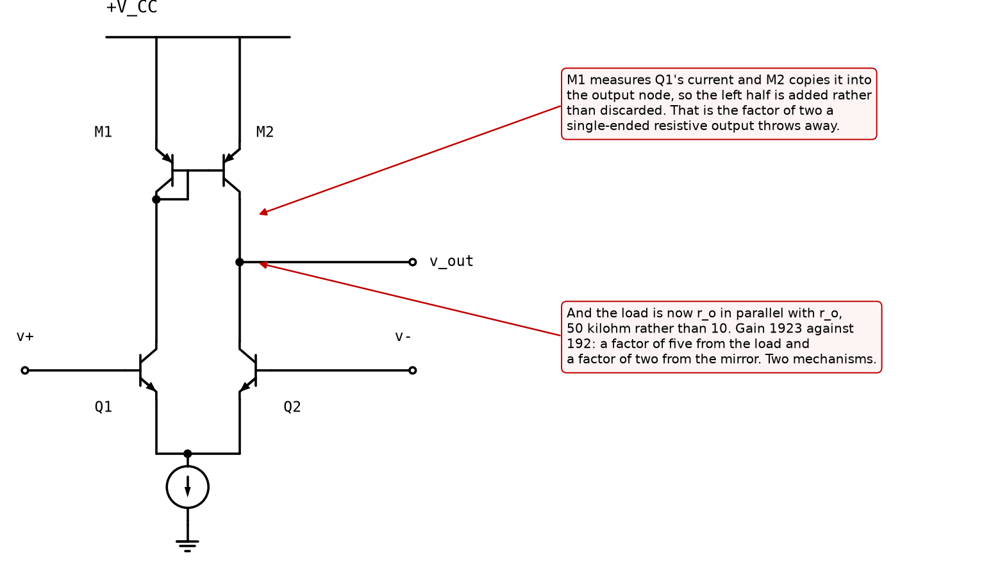

# Appendix B - Rejection, the mirror, and what limits it

Where the rejection comes from, which is not where most people guess, and the load that wins two
independent factors at once.

---

## B.1 Common mode, and the tail doubled

Drive both bases with the same voltage $v_{cm}$. Both halves want more current, the tail cannot
supply it, so the tail node rises and the current barely changes.

**The tail carries the sum of both currents**, so from one half's point of view a resistance
$R_{tail}$ in the tail behaves as $2R_{tail}$ in its own emitter. Then it is L07's degenerated
stage, unchanged:

$$A_{cm} = -\frac{R_C}{2R_{tail} + r_e}$$

With 10 kilohm in the tail and a 2 mA pair that is $-0.50$: the stage has a gain of *one half* for
signals both inputs share, against 192 for signals they do not.

<!-- value: 0.50 = abs(diffpair_common_mode_gain(10e3, 2e-3, 10e3)) -->

**Nothing new has been introduced.** The common-mode gain is the emitter factor doing exactly what
[L07 A.5](../../L07/appendix/a_the_small_signal_model.md#a5-what-the-emitter-resistor-does-to-the-gain)
said it does, with $R_E = 2R_{tail}$. The pair is not a new circuit; it is two old ones wired so
that one input sees degeneration and the other does not.

---

## B.2 CMRR, and the term that cancels

The ratio of the two is the figure of merit:

$$CMRR = \frac{A_{dm}}{A_{cm}} = \frac{R_C/2r_e}{R_C/(2R_{tail} + r_e)} = \frac{2R_{tail} + r_e}{2 r_e}$$

**Look at what happened to $R_C$.** It cancelled, exactly and completely.

$$\boxed{\;CMRR \approx \frac{R_{tail}}{r_e}\;}$$

<!-- value: 385 = cmrr(10e3, 2e-3, 10e3) -->

**So no choice of collector resistor improves rejection**, and neither does the gain. A designer
who doubles $R_C$ doubles both gains and rejects exactly as badly as before. This is the single
most useful thing in the lecture, because the instinct is universally the other way: rejection
feels like it should be about how well the two halves match, or about how much gain there is, and
it is about neither.

**It is about the tail, and only about the tail.**

---

## B.3 Which makes it a supply-voltage question

A resistor in the tail has to carry the tail current. So a tail resistance implies a voltage:

$$V_{tail} = I_{tail} R_{tail}$$

| Tail       | CMRR  | In decibels | Volts across it at 2 mA |
| ---------- | ----- | ----------- | ----------------------- |
| 1 kilohm   | 39    | 32 dB       | 2 V                     |
| 10 kilohm  | 385   | 52 dB       | 20 V                    |
| 100 kilohm | 3847  | 72 dB       | 200 V                   |
| 260 kilohm | 10000 | **80 dB**   | **520 V**               |
| 1 megohm   | 38462 | 92 dB       | 2000 V                  |

<!-- value: 52 = decibels(cmrr(10e3, 2e-3, 10e3)) -->

**80 dB of rejection from a resistor needs 520 V of supply**, and 80 dB is an unremarkable
requirement. A current source presents hundreds of kilohms or megohms of *incremental* resistance
while dropping a volt or two of *actual* voltage, because its resistance is $r_o$ and $r_o$ has
nothing to do with the voltage across it.

**That is the whole reason the tail is a current source**, and it is worth stating as a general
principle rather than a fact about pairs: **a current source is a device that has a large
resistance without having a large voltage across it.** Every use of one in this course, including
L07's mirror load, is that same trade.

**A cascoded mirror** raises $r_o$ by another factor of $\beta$
([L07 B.5](../../L07/appendix/b_the_emitter_factor.md#b5-miller-and-the-cascode)), so it buys
another 30 dB or so for one more transistor and about 0.7 V of headroom. That is the usual
arrangement in an integrated operational amplifier.

---

## B.4 The mirror load, and its two mechanisms

Replace the two collector resistors with a **current mirror**: two PNP devices, emitters to the
rail, bases tied, the left one diode-connected.

M1 carries whatever Q1 carries, and M2 copies that current into the output node. So when a
differential input pushes Q1's current up and Q2's down, the mirror pushes the output node up
while Q2 pulls it down. **Both halves now drive the output.**

$$A_{dm} = -\frac{r_{o(n)} \parallel r_{o(p)}}{r_e}$$

<!-- value: 1923 = abs(diffpair_mirror_gain(2e-3, parallel(early_resistance(1e-3), early_resistance(1e-3)))) -->

**1923, against 192 for the resistively loaded single-ended pair. A factor of ten, and it is two
separate factors:**

* **A factor of two from the mirror as a mirror.** The two in $R_C/2r_e$ came from throwing one
  collector away, and the mirror stops throwing it away. This has nothing to do with resistance.
* **A factor of five from the load.** $r_o \parallel r_o$ is 50 kilohm where the resistor was 10.
  This has nothing to do with mirroring.

**They multiply, and they are commonly run together in textbooks.** Separating them is worth the
paragraph because only the second is available to a resistively loaded stage, and only the first
survives if the following stage's input resistance is low enough to dominate the output node,
which in a discrete amplifier it usually is.

**And this is the third distinct job a current mirror has done in this course**, all from the same
device: it stops L07's degeneration boost being swamped, it gives L09's tail a large resistance
without a large voltage, and it recovers L09's discarded half. One circuit, three arguments.

---

## B.5 The other output, and why the answer changes completely

Everything above takes the output at **one collector**, because that is what feeds the next stage
in an operational amplifier. Take the **difference between the two collectors** instead and the
rejection is set by something else entirely, and the difference is 46 decibels.

**Why.** A common-mode input moves both collectors down by the same amount. With a single-ended
output that motion *is* the output, so the tail alone decides how large it is, and matching does
not enter at first order. With a differential output the same motion appears identically on both
collectors and **subtracts out exactly**, provided the two halves match. What survives is the
mismatch acting on it:

$$CMRR_{diff} = \frac{2R_{tail}}{\delta\, r_e}$$

| Output taken                | Limited by        | With a 10 kilohm tail |
| --------------------------- | ----------------- | --------------------- |
| One collector               | the tail alone    | 52 dB                 |
| Both, 5 per cent mismatch   | tail and matching | 84 dB                 |
| Both, 1 per cent mismatch   | tail and matching | 98 dB                 |
| Both, 0.1 per cent mismatch | tail and matching | 118 dB                |

<!-- value: 98 = decibels(cmrr_differential(2e-3, 10e3, 0.01)) -->

**Forty-six decibels, from ordinary 1 per cent resistors and a change in where you put the
voltmeter.** The circuit is identical.

**So "the CMRR of a differential pair" is not a statement about a circuit** unless it says which
output is being taken. The two arrangements have different limits, respond to different fixes, and
differ by two orders of magnitude at ordinary component tolerances.

**And it explains where integrated amplifiers get their 100 dB.** Not from exotic tails, but from
two devices adjacent on one die, made in the same step, matching to a fraction of a per cent,
combined with a differential output that turns that matching into rejection. The same schematic
built from two discrete transistors and a resistor tail, single-ended, gives 52 dB and no amount of
care in the tail changes the arithmetic.

**Why this course still uses the single-ended output.** Because an operational amplifier's second
stage has one input, so the difference has to be taken somewhere, and taking it with a current
mirror is [B.4](#b4-the-mirror-load-and-its-two-mechanisms). A mirror-loaded pair has a
single-ended output and recovers the differential *gain*; its common-mode rejection is the
mirror's matching rather than the resistors', which is better but is the same kind of quantity.

---

## B.6 Offset, matching, and why modern input stages are MOSFET

With both inputs at zero the output should be at its quiescent value. It is not, and the
difference referred back to the input is the **input offset voltage**.

| Source                                                            | Size                            | Input-referred offset |
| ----------------------------------------------------------------- | ------------------------------- | --------------------- |
| 1 mV of $V_{BE}$ mismatch                                         | typical of two discrete devices | **1 mV**, directly    |
| 1 per cent of $R_C$ mismatch                                      | ordinary resistors              | 0.52 mV               |
| 20 microamps of base current through a 10 kilohm source imbalance |                                 | **200 mV**            |

<!-- value: 0.52 = diffpair_input_offset(0.01, 0.0, 10e3, 2e-3) * 1e3 -->

**The third row is not a misprint, and it dominates everything else by two orders of magnitude.**
A base current of 20 microamps flowing through 10 kilohm produces 200 mV, and if the two inputs
are driven from different source resistances that voltage does not cancel.

**The classical fix is to make the two source resistances equal**, so that the two base currents
produce the same voltage and it becomes common-mode. That works, it is why textbook op-amp
circuits put a resistor in the non-inverting input equal to the parallel combination in the
feedback network, and it leaves the *difference* between the two base currents, which is smaller
by the beta mismatch. A 1 per cent beta mismatch leaves 0.2 microamps, and through 10 kilohm that
is 2 mV.

**The modern fix is to have no base current.** A MOSFET gate draws nothing, so the whole row
disappears rather than being cancelled, and with it the requirement that the two sources match.

**And that is the trade, stated plainly**: a MOSFET input pair has perhaps a tenth of the gain of
a bipolar one at the same current, because $r_s$ is ten times $r_e$
([L07 B.6](../../L07/appendix/b_the_emitter_factor.md#b6-the-mosfet-in-one-substitution)), and it
has none of the input-current problem. **Almost every modern operational amplifier takes that
trade**, and recovers the gain in the second stage where it is cheap.

There is a third option, which is the best of both and costs two more devices: **bipolar inputs
with source followers in front of them**. High input resistance from the
followers, high gain from the pair.

---

## B.7 What to build

### `ael/diffpair/pair.hpp`

| Function                                                                 | Returns                                                                                          |
| ------------------------------------------------------------------------ | ------------------------------------------------------------------------------------------------ |
| `intrinsicEmitterResistance(tailCurrent)`                                | $V_T/(I_{tail}/2)$. **Half** the tail.                                                           |
| `differentialGain(load, tailCurrent, degeneration)`                      | $-R_C/(2(r_e + R_E))$, single-ended.                                                             |
| `commonModeGain(load, tailCurrent, tailResistance, degeneration)`        | $-R_C/(2R_{tail} + r_e + R_E)$.                                                                  |
| `commonModeRejection(load, tailCurrent, tailResistance, degeneration)`   | The ratio, as a plain number.                                                                    |
| `commonModeRejectionDifferential(tailCurrent, tailResistance, mismatch)` | [B.5](#b5-the-other-output-and-why-the-answer-changes-completely)'s figure, for both collectors. |
| `mirrorGain(tailCurrent, load)`                                          | $-R_{load}/r_e$: no factor of two.                                                               |
| `transfer(differentialInput, tailCurrent)`                               | $I_{tail}\tanh(v_d/2V_T)$.                                                                       |
| `linearRange(tolerance)`                                                 | The input at which `transfer` falls `tolerance` below its tangent.                               |
| `inputOffset(loadMismatch, vbeMismatch, load, tailCurrent)`              | Input-referred, from both causes.                                                                |
| `decibels(ratio)`                                                        | $20\log_{10}$, because every figure above is quoted both ways.                                   |

**`commonModeRejection` must be implemented as the ratio of the other two**, not as a separate
formula. The lecture's central claim is that $R_C$ cancels out of that ratio; writing it as a
ratio makes the code demonstrate the cancellation, and one shipped test checks it by asking for
the rejection at two very different loads and requiring the answers to agree to machine precision.

**`linearRange` must not have the tail current as a parameter.** If your derivation produced one,
it has a factor that should have cancelled.

### What good looks like

About sixty lines, of which `linearRange` is the only one that iterates.

---

## B.8 What this appendix is blind to

* **Temperature.** Everything here is at one temperature and the two halves are at the same one.
  Offset drifts about 3 microvolts per degree per millivolt of offset, which is the specification
  that actually matters in a precision amplifier, and it is not derived here.
* **The mirror's own mismatch**, which appears directly as offset in a mirror-loaded pair and is
  the reason the mirror devices are matched as carefully as the input pair.
* **Noise.** A differential pair's input noise is the main reason to choose one over another in
  practice.
* **Common-mode input range.** The pair stops working when the inputs approach either rail, and
  the tail source needs a volt or two of its own. Not treated, and it is a common way a design
  fails in the last 10 per cent of its input range.
* **Frequency, again.** The mirror adds a pole that the resistive load does not, because the
  diode-connected side has $r_e$ and capacitance on it, and in a real amplifier that pole is close
  enough to matter.

---
