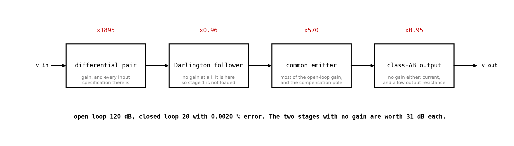

# Appendix A - The amplifier, stage by stage
Eleven transistors, and not one of them is new.

---

## A.1 The black box, opened
[L03](../../L03/README.md) used an operational amplifier on the promise that L10 would build one.

| Stage | What it is                          | What it is responsible for                        | Gain |
| ----- | ----------------------------------- | ------------------------------------------------- | ---- |
| 1     | Mirror-loaded differential pair     | Gain, and **every input specification there is**  | 1895 |
| 2     | Darlington emitter follower         | Nothing, except not loading stage 1               | 0.96 |
| 3     | Common-emitter, current-source load | Most of the open-loop gain, and the dominant pole | 570  |
| 4     | Class-AB Darlington output          | Current, and a low output resistance              | 0.95 |

**Two of the four have no voltage gain.** They are six of the eleven transistors, and
[B.2](./b_the_budget_and_the_loop.md#b2-the-two-stages-with-no-gain) is about why they are the most
valuable part of the amplifier.

---

## A.2 The whole thing

Every block is a circuit from an earlier lecture:
* **Q1, Q2, M1, M2 and the tail** are [L09](../../L09/README.md)'s mirror-loaded pair, entire.
* **Q3 and Q4** are [L08](../../L08/README.md)'s Darlington follower.
* **Q5** is [L07](../../L07/README.md)'s common-emitter stage with the current-source load of
  [L07 B.4](../../L07/appendix/b_the_emitter_factor.md#b4-which-is-exactly-why-a-current-mirror-load-exists).
* **Q6 to Q9, the diodes and the 0.22 ohm resistors** are
  [L08 B.3](../../L08/appendix/b_the_output_stage.md#b3-class-ab-and-the-26-millivolt-rule)'s
  class-AB output stage, each half a Darlington.
* **C_c** is the only component here this course has not built, and is
  [B.4](./b_the_budget_and_the_loop.md#b4-compensation-and-the-pole-that-is-made-dominant)'s
  subject.

**The three current sources are drawn as current sources rather than as mirrors** because that is
what they are, small-signal: a resistance of $r_o$ with a current through it that does not depend
on the node voltage. Each is two more transistors in a real build, and
[L09 B.3](../../L09/appendix/b_rejection_and_the_mirror.md#b3-which-makes-it-a-supply-voltage-question)
established why they are not resistors.

---

## A.3 Stage 1: the pair, and why it is first
**The input stage decides every input specification the amplifier has:** offset, input current,
input resistance, common-mode range, common-mode rejection, most of the noise. **Nothing downstream
improves any of them,** because feedback divides down what happens *after* the input, not *at* it.
It also has to have gain, because the loop gain starts here.

**Mirror-loaded, for the two reasons of
[L09 B.4](../../L09/appendix/b_rejection_and_the_mirror.md#b4-the-mirror-load-and-its-two-mechanisms).**
The mirror recovers the half a single-ended output would discard and presents $r_o$ rather than a
resistor. 1923 unloaded.

<!-- value: 1923 = opamp_budget()["stage1_unloaded"] -->

---

## A.4 Stage 2: the buffer, which does nothing
Stage 3 is a common-emitter stage at 1 mA, so its input resistance is $\beta r_e$: **1.3 kilohm**.
Stage 1's output resistance is **50 kilohm**. Connect them directly and stage 1 keeps

$$\frac{1300}{50000 + 1300} = 2.5\ \text{per cent}$$

of its gain. **1923 becomes 48.7, and the amplifier has lost 32 dB before doing anything.**

**So a follower goes between them,** a Darlington one: a single follower would present
$\beta(r_e + 1300) = 66$ kilohm, only a little more than the 50 it is protecting. The Darlington
presents $\beta^2(2r_e + 1300) = 3.4$ megohm and stage 1 keeps 98.5 per cent.

<!-- value: 3.4 = opamp_budget()["buffer_input"] / 1e6 -->

**It costs 0.34 dB of signal and it is worth 31.5 dB of loop gain.**

<!-- value: 31.5 = opamp_buffer_worth() -->

---

## A.5 Stage 3: where the gain is
A common-emitter stage at 1 mA with a current-source load, $r_o$ against $r_o$, so 50 kilohm and an
unloaded gain of $50000/26 = 1923$: the same as stage 1 and for the same reason.

**Undegenerated,** because every ohm in its emitter divides the gain
([L07 A.5](../../L07/appendix/a_the_small_signal_model.md#a5-what-the-emitter-resistor-does-to-the-gain))
and this stage exists to produce gain. The cost is
[B.3](./b_the_budget_and_the_loop.md#b3-the-operating-point-that-does-not-exist): it has no stable
operating point of its own, and only the loop gives it one.

**It is also where the compensation goes,** the highest-impedance node being the cheapest place to
put a dominant pole
([B.4](./b_the_budget_and_the_loop.md#b4-compensation-and-the-pole-that-is-made-dominant)).

---

## A.6 Stage 4: the output, which also does nothing
Class AB from [L08](../../L08/appendix/b_the_output_stage.md), idling at 120 mA with 0.22 ohm
emitter resistors and two diodes of bias that must sit on the heatsink.

**Each half is a Darlington,** for stage 2's reason: an 8 ohm loudspeaker behind a single follower
presents 411 ohm to a stage with 50 kilohm of output resistance, which would keep 0.8 per cent of
its gain. Behind a Darlington it presents **21 kilohm** and stage 3 keeps 30 per cent.

<!-- value: 21 = opamp_budget()["output_input"] / 1e3 -->

**Thirty per cent is still the largest single loss in the amplifier,** 10.6 dB: the price of
driving 8 ohms from a 50 kilohm node, and no arrangement of two transistors gets it back. A third
would, which is
[L08 C.2](../../L08/appendix/c_power_amplifiers.md#c2-why-one-darlington-is-not-the-end-of-it)'s
triple emitter follower.

---

## A.7 What this appendix is blind to
* **Every frequency except one.** The compensation pole is discussed; the other poles, and so the
  actual stability margin, are computed nowhere.
* **Slew rate,** the tail current over the compensation capacitor, and the one large-signal
  specification a reader could compute from what is here
  ([L09 A.4](../../L09/appendix/a_the_pair.md#a4-what-the-small-signal-model-cannot-see)).
* **Start-up.** The three current sources have to start, and a mirror whose reference derives from
  its own output has a stable state at zero current. Real designs include a start-up circuit.
* **Supply rejection.** The rails are drawn as ideal. They are not.
* **Everything about layout,** which decides how much of the above survives being built.

---
