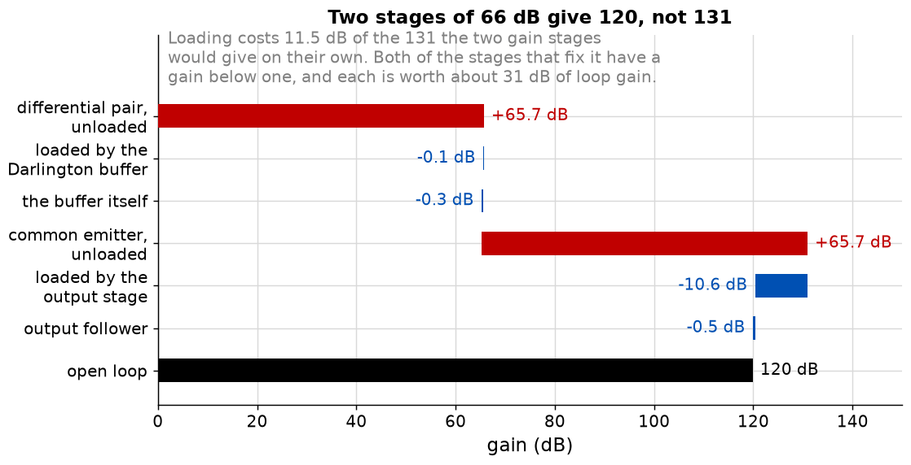

# Appendix B - The budget, the missing operating point, and the loop
Where the gain goes, why the amplifier cannot be biased, and what closing the loop buys.

---

## B.1 Two stages of 66 dB give 120, not 131


|                            | dB        |
| -------------------------- | --------- |
| Stage 1, unloaded          | +65.7     |
| Loaded by the buffer       | -0.1      |
| The buffer itself          | -0.3      |
| Stage 3, unloaded          | +65.7     |
| Loaded by the output stage | **-10.6** |
| The output follower itself | -0.5      |
| **Open loop**              | **119.9** |

<!-- value: 119.9 = decibels(opamp_open_loop_gain()) -->

**11.5 dB of the 131.4 the two gain stages would give is lost to loading,** and not evenly: 10.6 is
one number, stage 3 driving the output stage.

<!-- value: 11.5 = opamp_loading_loss() -->

**This is L01's loading arithmetic for the last time,** the sixth appearance of one subtraction.
**An amplifier's gain budget is not the product of its stage gains, and a budget computed without
loading is wrong by a factor of 3.7 in the optimistic direction.**

---

## B.2 The two stages with no gain
Stage 2 has a voltage gain of 0.96 and stage 4 of 0.95. Together they are six of the eleven
transistors and they amplify nothing. **Take each away and measure:**

|                                                         | Open loop    |
| ------------------------------------------------------- | ------------ |
| As designed                                             | **119.9 dB** |
| With stage 1 driving stage 3 directly                   | 88.4 dB      |
| With a single follower instead of the output Darlington | 88.9 dB      |

<!-- value: 88.4 = decibels(opamp_budget()["stage1_unloaded"] * opamp_budget()["stage2_input"] / (opamp_budget()["pair_load"] + opamp_budget()["stage2_input"]) * opamp_budget()["stage2"] * opamp_budget()["output"]) -->

**Each of the two stages with no gain is worth about 31 dB,** more than any two-transistor gain
stage in the course could deliver. A stage that loses 0.3 dB of signal buys 31.5 dB of loop.

<!-- value: 31.5 = opamp_buffer_worth() -->
<!-- value: 31.0 = opamp_output_worth() -->

**That is the lesson the whole course has been building to.** Gain is easy: one transistor and a
large load gives 66 dB. What is hard is **connecting two of them together**. Three transistors
amplify, Q1, Q2 and Q5; six connect.

---

## B.3 The operating point that does not exist
Try to solve the amplifier for its DC operating point with the loop open. It will not work, and the
reason is not the solver. The open-loop gain is 986,000 and the rails are $\pm 15$ V, so an input
offset of

$$\frac{15}{986000} = 15\ \mu\text{V}$$

<!-- value: 15 = 15.0 / opamp_open_loop_gain() * 1e6 -->

puts the output hard against a rail. **A pair of transistors matched to 15 microvolts does not
exist,** and neither does an amplifier whose open-loop output sits anywhere but a rail.

**So the DC solve either fails to converge or converges on a saturated output, and both are correct
answers.** A solver reporting the output at $-15$ V has not failed.

**Which is why the stage gains have to be measured stage by stage.** Bias each stage alone, perturb
its input, measure its output, multiply. The whole amplifier can only be solved with the loop
closed, and then what you measure is the closed-loop gain of 20.

**And it is why stage 3 is undegenerated.** A designer looking at it in isolation would call it
unbiasable and add an emitter resistor. Inside the loop it does not need one: the loop sets its
operating point. **The stage is not a stage; it is part of a loop, and it cannot be judged alone.**

---

## B.4 Compensation, and the pole that is made dominant
Four stages give at least four poles, each up to 90 degrees of lag, and
[L04](../../L04/README.md) established that 180 degrees with a loop gain above one is an oscillator.
**The fix is not to make the amplifier fast, but to make it slow, deliberately, in one place.**

$C_c$ bridges stage 3's collector and base. It is a Miller capacitor
([L07 B.5](../../L07/appendix/b_the_emitter_factor.md#b5-miller-and-the-cascode)), so the input sees
$C_c(1 + 1923)$, which against that node's resistance puts a pole at a few tens of hertz. That
resistance is not stage 3's 1.3 kilohm base resistance alone: the buffer's 72 ohm is in parallel,
so the node sees 68 ohm. **The buffer is what makes $C_c$ large.** Every other pole is at hundreds
of kilohertz or above.

**So by the time the other poles contribute phase, the loop gain is already below one.** The cost
is bandwidth: the open-loop gain falls 20 dB per decade from that pole, and the closed-loop
bandwidth is the gain-bandwidth product over the closed-loop gain. **This is L07's Miller effect
used on purpose:** what ruined a common-emitter stage's bandwidth makes a four-stage amplifier
usable.

**What this course does not do** is compute the other poles, so it cannot say what $C_c$ should be.
That needs the capacitances of
[L07 B.8](../../L07/appendix/b_the_emitter_factor.md#b8-what-this-appendix-is-blind-to).

---

## B.5 Closing the loop
Wrap a divider from the output back to the inverting input with a feedback fraction of
$\beta_f = 1/20$, and [L04](../../L04/README.md)'s arithmetic applies unchanged:

|                   | Value              |
| ----------------- | ------------------ |
| Open-loop gain    | 986,000            |
| Feedback fraction | 1/20               |
| Loop gain         | 49,300             |
| Closed-loop gain  | 19.99959           |
| Error from 20     | **0.002 per cent** |

<!-- value: 0.002 = gain_error(opamp_open_loop_gain(), 1.0 / 20.0) * 100 -->

**And the thing that matters more than the error.** The output stage's input resistance goes as
$h_{FE}^2$, which varies by a factor of a hundred across an ordinary beta spread:

| $h_{FE}$ | Open loop | Closed-loop gain |
| -------- | --------- | ---------------- |
| 20       | 106.4 dB  | 19.998096        |
| 50       | 119.9 dB  | 19.999594        |
| 200      | 129.2 dB  | 19.999862        |

<!-- value: 106.4 = decibels(opamp_budget()["stage1"] * opamp_budget()["buffer"] * abs(loaded_gain(opamp_budget()["stage2_unloaded"], opamp_budget()["stage2_load"], darlington_input_resistance(0.12, 8.0, 20.0))) * opamp_budget()["output"]) -->

**The open-loop gain varies by a factor of 14. The closed-loop gain varies by nine parts in a
hundred thousand.** That is the whole argument for feedback, on this course's own numbers.
[L08 A.5](../../L08/appendix/a_the_follower.md#a5-the-darlington-and-the-price-of-beta-squared) said
an output stage works inside a loop rather than on its own; this is the measurement.

**Output resistance** goes the same way. Open loop, three terms: the 0.22 ohm emitter resistor, the
Darlington's $2r_e$ of 0.43 ohm, and stage 3's 50 kilohm over $h_{FE}^2$, which is 20 ohm and
dominates. **20.6 ohm over one plus the loop gain: 0.42 milliohm.** Not a real number, since the
wire to the loudspeaker limits the answer first, and saying so is the point of quoting it.

---

## B.6 What to build
### PNP support in `ael/net/netlist.hpp`
The amplifier has four PNP devices and your netlist has none. Add a polarity:

```cpp
enum class Polarity { Npn, Pnp };

void addBjt(Node collector, Node base, Node emitter, device::bjt::Parameters parameters = {},
            Polarity polarity = Polarity::Npn) noexcept;
```

**A PNP is an NPN with every voltage and current negated:** the stamp you have, evaluated at
$(-v_{BE}, -v_{BC})$ with the currents negated. Longer than fifteen lines and you are writing a
second device model.

### `ael/report/amplifier.hpp`
One structure, one function predicting every stage from L07 to L09's closed forms, one formatter.

```cpp
namespace ael::report
{
struct Design
{
    double tailCurrent{};       ///< Stage 1's tail, split between the two sides.
    double bufferCurrent{};     ///< Stage 2, the Darlington follower.
    double gainStageCurrent{};  ///< Stage 3, the common-emitter stage.
    double idleCurrent{};       ///< Stage 4's quiescent current, per half.
    double load{};              ///< The loudspeaker.
    double supply{};            ///< One rail, so the amplifier runs on plus and minus this.
    double beta{50.0};
    double earlyVoltage{100.0};
};

struct Stage
{
    std::string name{};
    double unloaded{};  ///< The stage on its own.
    double loadedBy{};  ///< The input resistance of the stage after it.
    double loaded{};    ///< What it delivers into that.
};

struct Budget
{
    std::vector<Stage> stages{};
};

/// The four stages, each loaded by the next stage's input resistance.
[[nodiscard]] Budget budget(const Design& design) noexcept;

/// The product of the loaded gains, and nothing else.
[[nodiscard]] double openLoopGain(const Design& design) noexcept;

/// L04's expression, applied to it.
[[nodiscard]] double closedLoopGain(const Design& design, double fraction) noexcept;

/// A table, one row per stage, predicted against measured.
[[nodiscard]] std::string format(const Budget& budget) noexcept;
}
```

**The member names are part of the specification,** because the suite reads
`budget.stages[0].loaded` and sets `design.tailCurrent` by name. `beta` and `earlyVoltage` are in
`Design` rather than fixed, because [B.5](#b5-closing-the-loop)'s whole argument is what happens
when they move.

**`budget` must call the functions from L07, L08 and L09 rather than restating their formulas.** It
is a composition, and if it contains an expression with $r_e$ in it then it has stopped being one.
One shipped test checks that the stage-1 figure agrees with `ael::diffpair::mirrorGain` to machine
precision.

### What good looks like
About eighty lines, of which `format` is half. There is no physics in this component at all, which
is what makes it the last one.

---

## B.7 What the capstone is for
The exercises end with one program that prints this:

```text
stage              predicted     measured    difference
1  input pair         1895.0       1837.2         -3.1 %
2  buffer                0.96         0.96        -0.1 %
3  voltage gain        570.4        548.6         -3.8 %
4  output                0.95         0.94        -0.9 %
open loop            986000       910000         -7.7 %
```

**The differences are the course,** and each has a name: the closed forms take $V_T$ as 26 mV where
the device computes $kT/q$; they take $r_o$ as $V_A/I_C$ where the device gives
$(V_A + V_{CE})/I_C$; beta is 50 in one and the transport model's incremental value in the other.
**A reader who can account for every row has understood the ten lectures. A reader whose rows agree
exactly has run the same code twice.**

---

## B.8 What this course is blind to
* **Frequency response, beyond one pole.** No device capacitances, no phase margin, no Bode plot of
  a real amplifier. The largest omission, and where a second course would start.
* **Noise.** Not mentioned anywhere. It decides the input stage of every precision amplifier and
  most of the choices in
  [L09 B.6](../../L09/appendix/b_rejection_and_the_mirror.md#b6-offset-matching-and-why-modern-input-stages-are-mosfet).
* **Distortion, quantitatively.** Where it comes from, never a number.
* **Temperature, beyond $V_{BE}$ drift.** No self-heating, no thermal models, no drift figures.
* **Integrated-circuit design.** Matching, layout, process variation and area are the subject next
  door; this course is discrete.
* **Anything above a few megahertz,** where transmission lines, package parasitics and
  electromagnetic compatibility take over from circuit theory.

**And one methodological blind spot.** Every number here comes from a model with eight parameters.
Real devices have a hundred and real amplifiers are measured rather than computed. What the course
teaches is how to *predict*, which is worth having because it says what a measurement should be,
and therefore when a measurement is telling you something.

---
